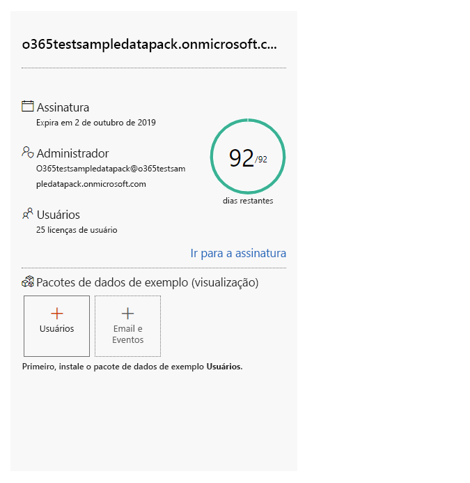
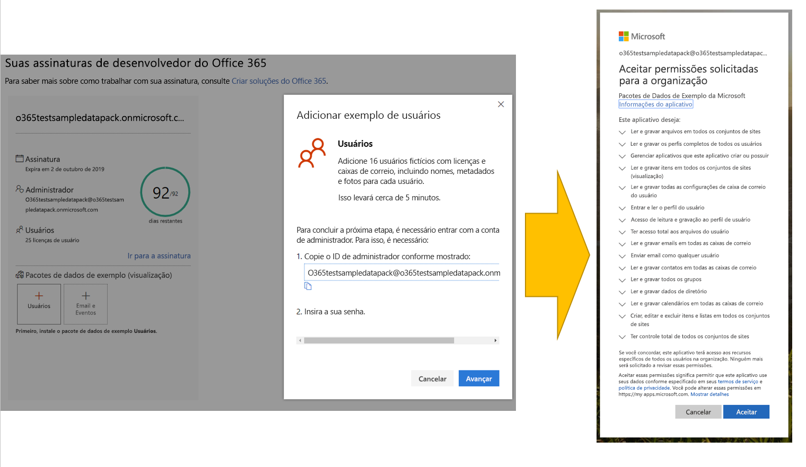
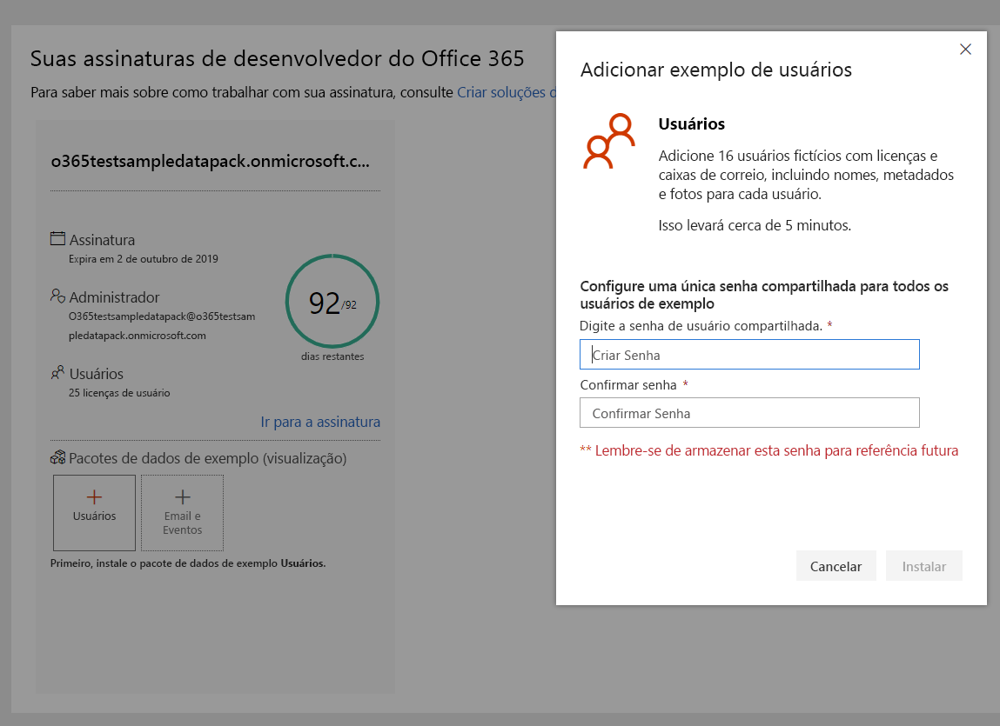
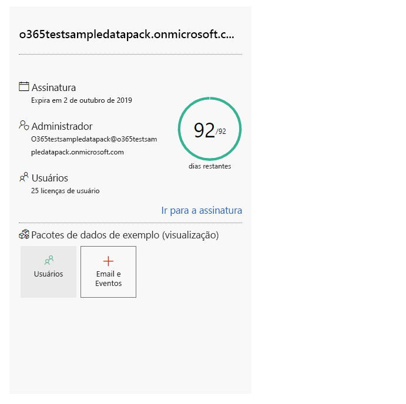

# Use pacotes de dados de exemplo com sua assinatura de desenvolvedor do Office 365

Você pode instalar pacotes de dados de exemplo na sua assinatura do desenvolvedor do Office 365. Os pacotes de dados de exemplo poupam seu tempo, instalando automaticamente dados e conteúdos necessários para criar e testar suas soluções. Inclui os usuários, os metadados e as fotos fictícias para simular um ambiente corporativo pequeno. Você pode instalar rapidamente os dados de exemplo para se concentrar nas suas soluções, em vez de perder tempo criando esses dados de exemplo.

Você pode encontrar pacotes de dados de exemplo no [painel do Programa para Desenvolvedores do Office 365](https://developer.microsoft.com/office/profile), na parte inferior do bloco de assinatura do Office 365.

Os pacotes de dados de exemplo a seguir estão atualmente disponíveis:

- Usuários - Instala 16 usuários fictícios com licenças, caixas de correio e metadados, incluindo nomes e fotos para cada usuário. Use as APIs do Microsoft Graph para trabalhar com os dados de exemplo de usuário da seguinte maneira:
  - Obter detalhes específicos do usuário
  - Atualizar usuário
  - Obter relatórios diretos
  - Preparar organograma  
  - Obter usuários por departamento

- Email e eventos - Adiciona conversas de email do Outlook e eventos de calendário para cada um dos 16 exemplos de usuários. Use as APIs do Microsoft Graph para trabalhar com os dados de exemplo de email e eventos da seguinte maneira:
  - Receba emails por usuários
  - Obter emails filtrados por data
  - Obter eventos futuros
  - Atualizar/excluir eventos futuros

> [!NOTE]
> Você deve instalar o pacote de dados de exemplo de Usuários antes de instalar o Email e Eventos.

## O que os pacotes de dados de exemplo adicionam à minha assinatura do Office 365?

O pacote de dados de exemplo de Usuários cria 16 usuários fictícios na sua assinatura e inclui as licenças para cada usuário, e caixas de correio, nomes, metadados e fotos para cada um deles.

O pacote de dados de exemplo de Email e Eventos adiciona conversas de email do Outlook e eventos de calendário para cada um dos 16 usuários instalados.

## Como faço para instalar o pacote de dados de exemplo de Usuários?

Antes de instalar o pacote de dados de exemplo de Usuários, certifique-se de que você tem uma assinatura de desenvolvedor do Office 365 e que atribuiu uma licença a si mesmo como administrador.

Para instalar o pacote de dados de exemplo de Usuários:

1. Selecione a caixa **Usuários** na parte inferior de seu bloco de assinatura.
2. Copie a ID do administrador. Será necessário acessar sua assinatura.
3. Insira sua ID e senha de administrador na página de entrada.
4. Conceda permissões como administrador da sua assinatura de desenvolvedor do Office 365.

5. Configure suas senhas para todos os usuários de exemplo. Será preciso ter uma senha compartilhada definida para facilitar a administração de todos os seus usuários fictícios.

6. Os dados serão instalados. A instalação levará cerca de 5 min.

7. Quando a instalação for concluída, você receberá uma notificação por email e a caixa em seu bloco de assinatura ficará verde. Agora, você pode instalar o pacote de dados de exemplo de Email e Eventos.

## Como instalar o pacote de dados de exemplo de Email e Eventos?

Depois de instalar o pacote de dados de exemplo Usuários, você pode instalar o Email e Eventos.

1. Escolha a caixa **Email &amp; Eventos** no bloco da sua assinatura.
2. Clique em **Instalar** para iniciar a instalação.

> [!NOTE]
> Se você acabou de criar sua assinatura, ela deve ser totalmente provisionada antes do início da instalação. Isso pode levar algumas horas. Após iniciada, a instalação pode levar até 20 minutos para ser concluída.

3. Quando a instalação for concluída, você receberá uma notificação por email e a caixa em seu bloco de assinatura ficará verde.

## Mais pacotes de dados de exemplo estão chegando?

Sim. Adicionaremos pacotes de dados de exemplo do SharePoint e do OneDrive. No futuro, consideraremos adicionar pacotes de dados de exemplo para mais produtos e tecnologias, incluindo Suplementos do Office, o Microsoft Teams e muito mais.

## Posso instalar pacotes de dados de exemplo em minhas outras assinaturas do Office 365?

Não. Esses pacotes de dados de exemplo são compatíveis apenas com a Assinatura de Desenvolvedor do Office 365, que você obtém como parte do Programa de Desenvolvedores do Office 365.

## Confira também

- [Configurar uma assinatura de desenvolvedor do Office 365](office-365-developer-program-get-started.md)
