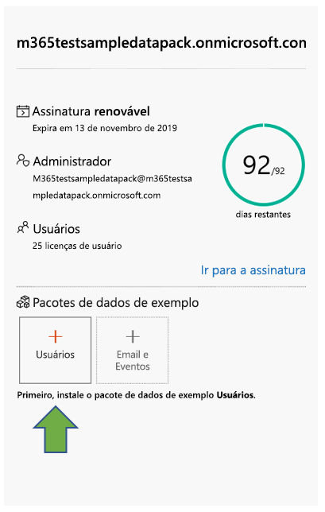
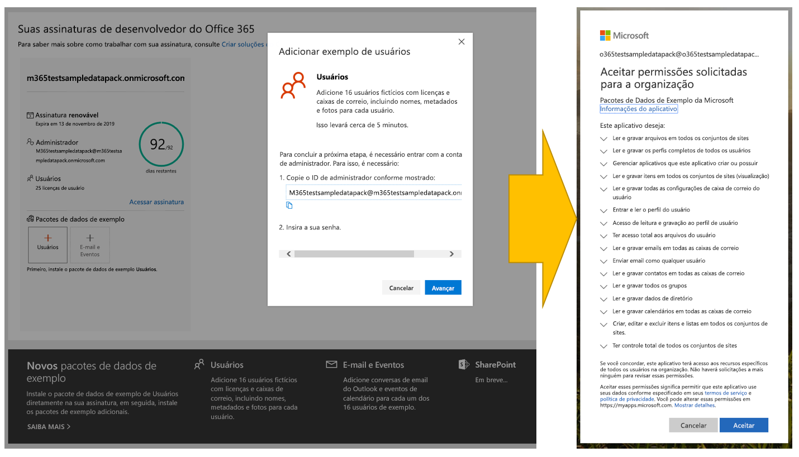
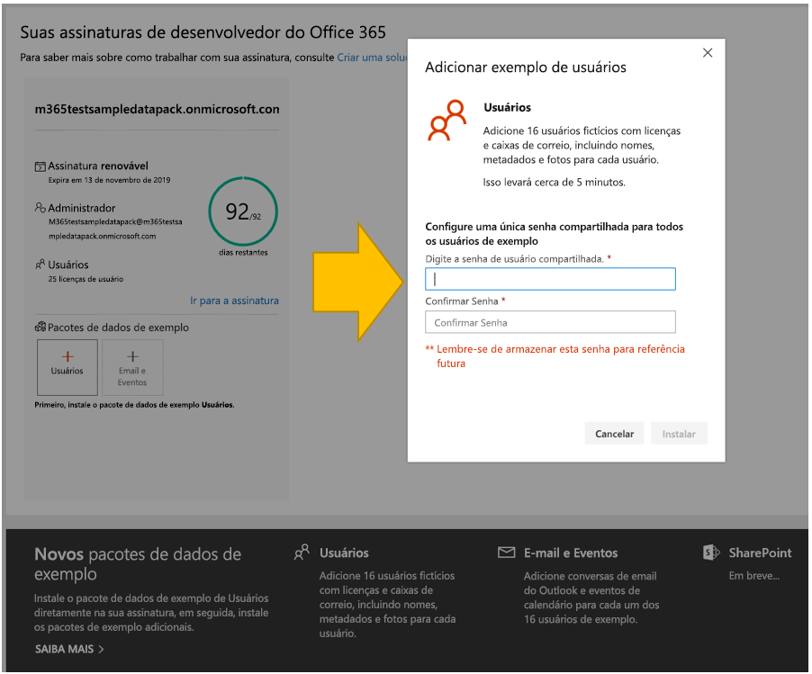
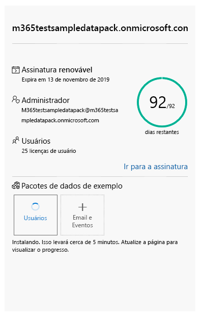
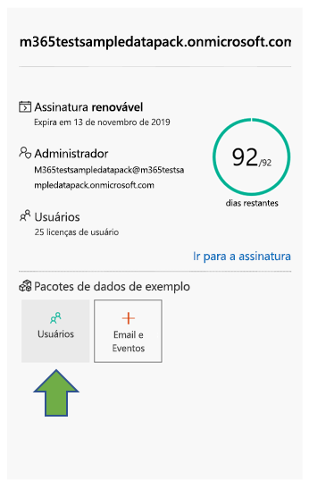
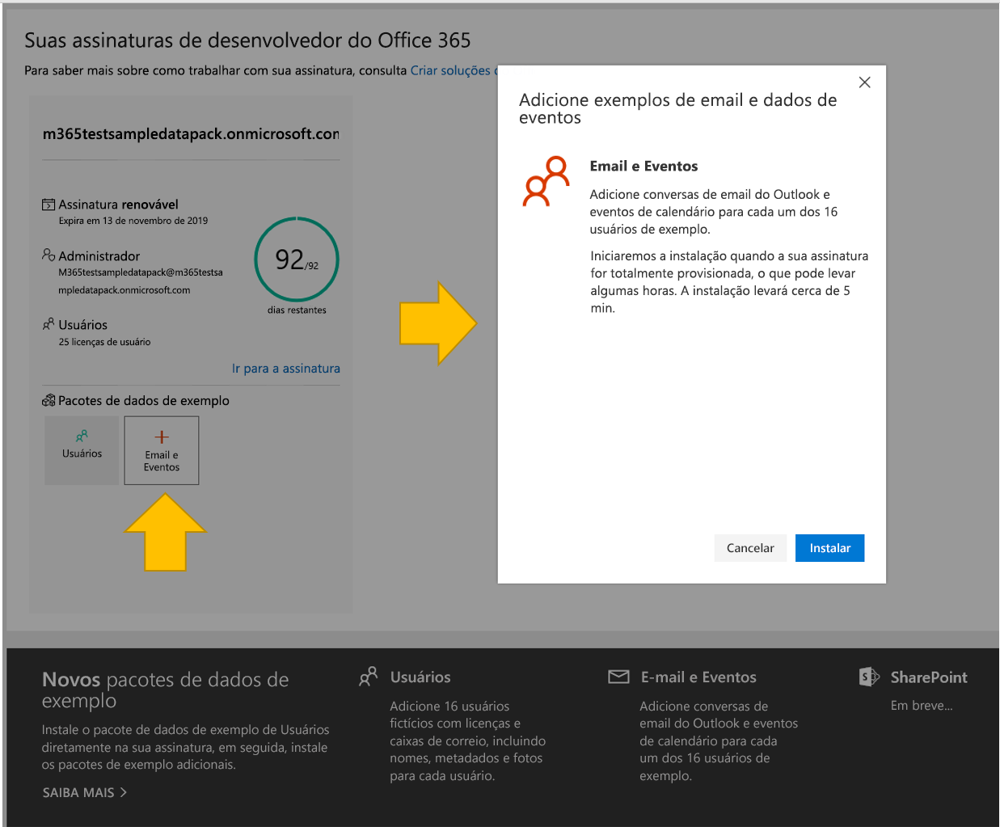
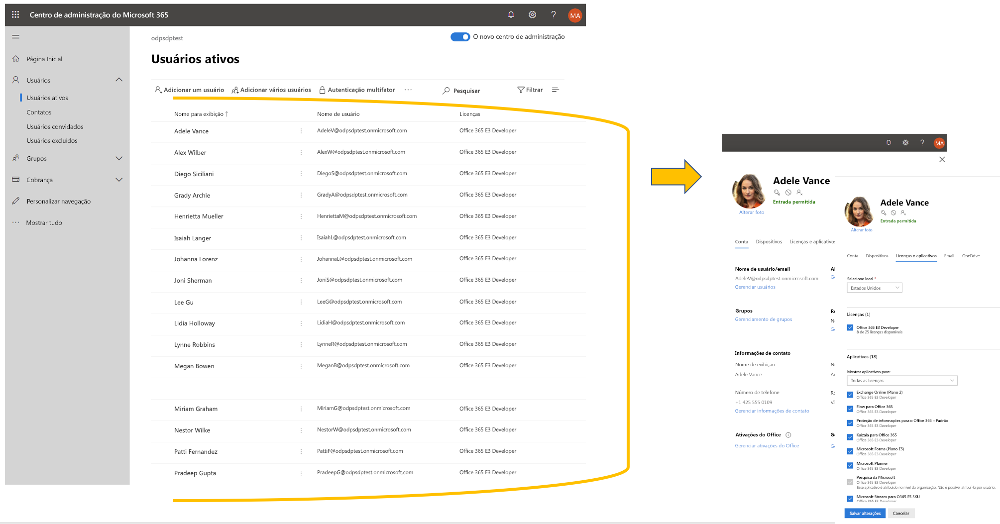
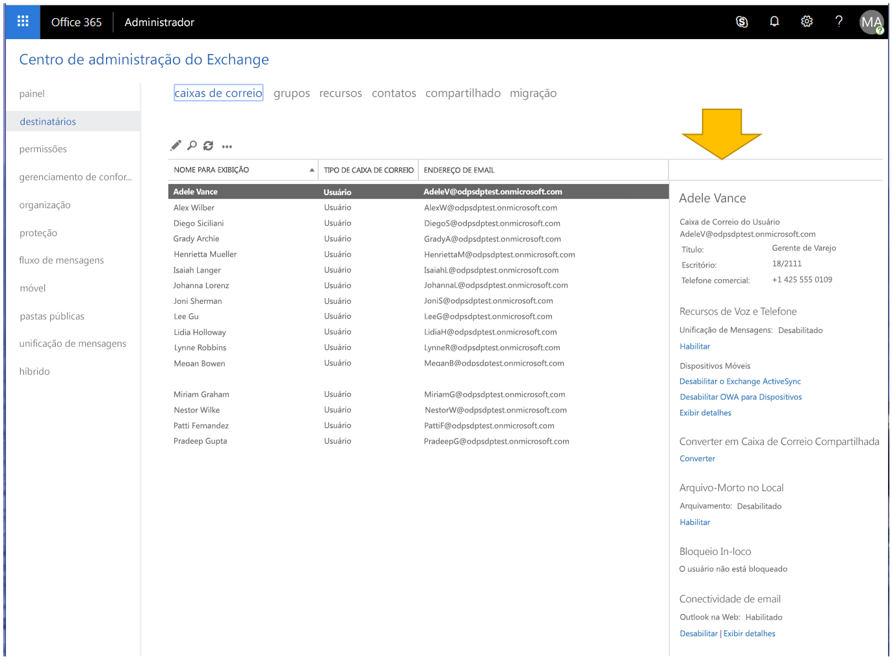

# Use pacotes de dados de exemplo com sua assinatura do Programa para Desenvolvedores do Microsoft 365Use sample data packs with your Microsoft 365 Developer Program subscription

Você pode instalar pacotes de dados de exemplo na sua assinatura do Programa para Desenvolvedores do Microsoft 365.You can install sample data packs on your Microsoft 365 Developer Program subscription. Os pacotes de dados de exemplo poupam seu tempo, instalando automaticamente dados e conteúdos necessários para criar e testar suas soluções.Sample data packs save you time by automatically installing data and content you need to build and test your solutions. Inclui os usuários, os metadados e as fotos fictícias para simular um ambiente corporativo pequeno.This includes fictitious users, metadata, and photos to simulate a small corporate environment. Você pode instalar rapidamente os dados de exemplo para se concentrar nas suas soluções, em vez de perder tempo criando esses dados de exemplo.You can quickly install the sample data so that you can focus on your solutions rather than spend time creating sample data yourself.

Você pode encontrar pacotes de dados de exemplo no [painel do Programa para Desenvolvedores do Microsoft 365](https://developer.microsoft.com/office/profile), na parte inferior do bloco de assinatura.You can find sample data packs on your [Microsoft 365 Developer Program dashboard](https://developer.microsoft.com/office/profile), at the bottom of your subscription tile.

Os pacotes de dados de exemplo a seguir estão atualmente disponíveis:The following sample data packs are currently available:

- Usuários - Instala 16 usuários fictícios com licenças, caixas de correio e metadados, incluindo nomes e fotos para cada usuário.Users - Installs 16 fictitious users with licenses, mailboxes, and metadata, including names and photos for each user. Use as APIs do Microsoft Graph para trabalhar com os dados de exemplo de usuário da seguinte maneira:Use Microsoft Graph APIs to work with user sample data in the following ways:
  - Obter detalhes específicos do usuárioGet specific user details
  - Atualizar usuárioUpdate user
  - Obter relatórios diretosGet direct reports
  - Preparar organogramaPrepare organization chart  
  - Obter usuários por departamentoGet users by department

- Email e eventos - Adiciona conversas de email do Outlook e eventos de calendário para cada um dos 16 exemplos de usuários.Mail and events - Adds Outlook email conversations and calendar events for each of the 16 sample users. Use as APIs do Microsoft Graph para trabalhar com os dados de exemplo de email e eventos da seguinte maneira:Use Microsoft Graph APIs to work with mail and events sample data in the following ways:
  - Receba emails por usuáriosGet emails by users
  - Obter emails filtrados por dataGet emails filtered by date
  - Obter eventos futurosGet upcoming events
  - Atualizar/excluir eventos futurosUpdate/delete upcoming events

> [!NOTE]
> Você deve instalar o pacote de dados de exemplo de Usuários antes de instalar o Email e Eventos.You must install the Users sample data pack before you install Mail and Events.

## O que os pacotes de dados de exemplo adicionam à minha assinatura?What do the sample data packs add to my subscription?

O pacote de dados de exemplo de Usuários cria 16 usuários fictícios na sua assinatura e inclui as licenças para cada usuário, e caixas de correio, nomes, metadados e fotos para cada um deles.The Users sample data pack creates 16 fictitious users on your subscription, and includes the licenses for each user, and mailboxes, names, metadata, and photos for each.

O pacote de dados de exemplo de Email e Eventos adiciona conversas de email do Outlook e eventos de calendário para cada um dos 16 usuários instalados.The Mail and Events sample data pack adds Outlook email conversations and calendar events for each of the 16 users installed.

## Como faço para instalar o pacote de dados de exemplo de Usuários?How do I install the Users sample data pack?

Antes de instalar o pacote de dados de exemplo de Usuários, certifique-se de que você tem uma assinatura de desenvolvedor do Microsoft 365 e que atribuiu uma licença a si mesmo como administrador.Before you install the Users sample data pack, make sure that you have a Microsoft 365 developer subscription and that you assign a license to yourself as the admin.

> [!NOTE]
> Certifique-se de que tem 16 usuários disponíveis na sua assinatura.Make sure that you have 16 users available in your subscription. Sua assinatura inclui 25 usuários.Your subscription includes 25 users. Se você já tiver configurado mais de 10 usuários, primeiro remova alguns usuários para garantir que a instalação seja bem-sucedida.If you have already configured more than 10 users, remove some users first to ensure that your installation is successful.

Para instalar o pacote de dados de exemplo de Usuários:To install the Users sample data pack:

1. Selecione a caixa **Usuários** na parte inferior de seu bloco de assinatura.Select the **Users** box at the bottom of your subscription tile.
2. Copie a ID do administrador. Será necessário acessar sua assinatura.Copy your administrator ID; you will need it to sign in to your subscription.
3. Insira sua ID e senha de administrador na página de entrada.Enter your administrator ID and password on the sign in page.
4. Conceda permissões como administrador da sua assinatura de desenvolvedor do Microsoft 365.Consent to the permissions as an administrator of your Microsoft 365 developer subscription.

5. Configure suas senhas para todos os usuários de exemplo.Configure your passwords for all sample users. Será preciso ter uma senha compartilhada definida para facilitar a administração de todos os seus usuários fictícios.You will need to have one shared password defined for easy administration of all your fictitious users.

6. Os dados serão instalados.The data will be installed. A instalação levará cerca de 5 min.The installation should take about 5 minutes.

7. Quando a instalação for concluída, você receberá uma notificação por email e a caixa em seu bloco de assinatura ficará verde.When installation is finished, you'll be notified by email, and the box on your subscription tile will be green. Agora, você pode instalar o pacote de dados de exemplo de Email e Eventos.You can now install the Mail and Events sample data pack.

## Como instalar o pacote de dados de exemplo de Email e Eventos?How do I install the Mail and Events sample data pack?

Depois de instalar o pacote de dados de exemplo Usuários, você pode instalar o Email e Eventos.After you've installed the Users sample data pack, you can install mail and events.

1. Escolha a caixa **Email &amp; Eventos** no bloco da sua assinatura.Choose the **Mail &amp; Events** box on your subscription tile.
2. Clique em **Instalar** para iniciar a instalação.Select **Install** to begin installation.

> [!NOTE]
> Se você acabou de criar sua assinatura, ela deve ser totalmente provisionada antes do início da instalação.If you just created your subscription, it must be fully provisioned before installation can begin. Isso pode levar algumas horas.This can take up to a few hours. Após iniciada, a instalação pode levar até 20 minutos para ser concluída.After installation starts, it can take up to 20 minutes to finish.

3. Quando a instalação for concluída, você receberá uma notificação por email e a caixa em seu bloco de assinatura ficará verde.When installation is finished, you'll be notified by email, and the box on your subscription tile will be green.

## Mais pacotes de dados de exemplo estão chegando?Are more sample data packs coming?

Sim.Yes. Adicionaremos pacotes de dados de exemplo do SharePoint e do OneDrive.We will add sample data packs for SharePoint and OneDrive. No futuro, consideraremos adicionar pacotes de dados de exemplo para mais produtos e tecnologias, incluindo Suplementos do Office, o Microsoft Teams e muito mais.In the future, we will consider adding sample data packs for more products and technologies, including Office Add-ins, Microsoft Teams, and more.

## Posso instalar pacotes de dados de exemplo em minhas outras assinaturas do Microsoft 365?Can I install sample data packs on my other Microsoft 365 subscriptions?

Não.No. Esses pacotes de dados de exemplo são compatíveis apenas com a assinatura de desenvolvedor do Microsoft 365, que você obtém como parte do Programa de Desenvolvedores do Microsoft 365.These sample data packs are only compatible with the Microsoft 365 developer subscription you get as part of the Microsoft 365 Developer Program.

## Como posso ver os dados de exemplo na minha assinatura?How can I see the sample data in my subscription?

Depois de instalar o pacote de dados de exemplo de Usuários, para ver os usuários que foram adicionados, acesse o **Centro de Administração do Microsoft 365** na assinatura de desenvolvedor de Microsoft 365.After you install the Users sample data pack, to see the users that were added, go to the **Microsoft 365 Admin Center** on your Microsoft 365 developer subscription. Em **Usuários**, selecione **Usuários ativos**.Under **Users**, select **Active users**. Você verá a lista de 16 usuários.You will see the list of 16 users. Você pode selecionar um usuário para exibir os metadados associados, incluindo as fotos e as licenças.You can select a user to view the associated metadata, including photos and licenses.

Depois de instalar o pacote de exemplo de Email e Eventos, para visualizar os dados de exemplo, no **Centro de administração do Microsoft 365**, escolha **Mostrar tudo** e, em seguida, selecione **Exchange**.After you install the Mail and Events sample pack, to see the sample data, in the **Microsoft 365 Admin Center**, choose **Show all** and then select **Exchange**. No Centro de administração do Exchange, ao selecionar **destinatários**, você pode ver que todos os 16 usuários têm caixas de correio com email e eventos adicionados.In the Exchange admin center, when you select **recipients**, you can see that each of the 16 users has mailboxes with mail and events added.

## Também consulteSee also

- [Configurar uma assinatura de desenvolvedor do Microsoft 365Set up a Microsoft 365 developer subscription](microsoft-365-developer-program-get-started.md)
