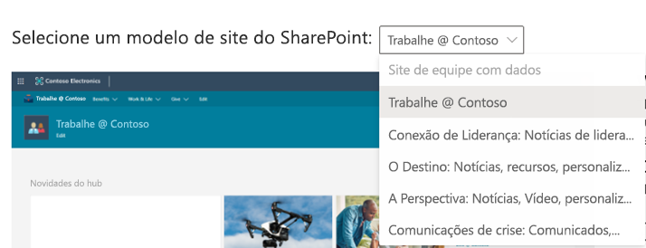

# Dados de exemplo da área restrita do desenvolvedor

A assinatura do Programa para Desenvolvedores da área restrita do Microsoft 365 vem com dados de exemplo para economizar tempo, fornecendo dados e conteúdo necessários para criar e testar suas soluções.

Se você tiver uma área restrita instantânea, os pacotes de dados de exemplo já virão pré-instalados. Sua área restrita instantânea inclui os seguintes dados de exemplo:

- **Dados de usuário, correio e calendário do Microsoft Graph** - 16 usuários de exemplo com dados e conteúdo do usuário para ajudá-lo a modelar suas soluções. Isso inclui caixas de correio de usuário, eventos de calendário e integração em um ambiente de desenvolvedor do Teams com conversas simuladas e associações de equipe.
- Pacote de **Dados de exemplo do Teams** com o seguinte ambiente de desenvolvedor personalizado:
  - **Sideload do aplicativo** pré-configurado
  - **Cinco exemplos de equipes, canais, guias e sessões de conversas** criadas em torno dos 16 usuários de exemplo.
  - **App Studio / Portal do Desenvolvedor do Teams pré-instalado e fixado** para ajudá-lo a agilizar a criação de seu manifesto do aplicativo do Teams e pacote do aplicativo, além do editor de cartão e uma biblioteca de controle do React.
    
    
- **Dados de exemplo da Estrutura do SharePoint** – escolha entre seis modelos de site que você pode instalar e avaliar como soluções personalizadas para sua organização (com um pré-instalado).

Se você tiver uma área restrita configurável, poderá instalar rapidamente os dados de exemplo para que possa se concentrar em suas soluções, em vez de perder tempo criando dados de exemplo sozinho.

> [!NOTE] 
> Você não pode instalar pacotes de dados de exemplo em qualquer outra assinatura do Microsoft 365. Esses pacotes de dados de exemplo são compatíveis apenas com a assinatura da área restrita do desenvolvedor do Microsoft 365 que você obtém como parte do Programa para Desenvolvedores do Microsoft 365.

## Instale pacotes de dados de exemplo em sua área restrita configurável

Você pode encontrar pacotes de dados de exemplo no [painel do Programa para Desenvolvedores do Microsoft 365](https://developer.microsoft.com/microsoft-365/profile), na parte inferior do bloco de assinatura.

Os pacotes de dados de exemplo a seguir estão atualmente disponíveis:

- Usuários - Instala 16 usuários fictícios com licenças, caixas de correio e metadados, incluindo nomes e fotos para cada usuário. Use as APIs do Microsoft Graph para trabalhar com os dados de exemplo de usuário da seguinte maneira:
  - Obter detalhes específicos do usuário
  - Atualizar usuário
  - Obter relatórios diretos
  - Preparar organograma  
  - Obter usuários por departamento

- Email e eventos - Adiciona conversas de email do Outlook e eventos de calendário para cada um dos 16 usuários de exemplo. Use as APIs do Microsoft Graph para trabalhar com os dados de exemplo de email e eventos da seguinte maneira:
  - Receba emails por usuários
  - Obter emails filtrados por data
  - Obter eventos futuros
  - Atualizar/excluir eventos futuros

  > [!NOTE]
  > Você deve instalar o pacote de dados de exemplo de Usuários antes de instalar o Email e Eventos.
    
- Dados de exemplo da Estrutura do SharePoint – Escolha entre seis modelos de site que você pode instalar e avaliar como soluções personalizadas para sua organização (com um pré-instalado).

### Instalar o pacote de dados de exemplo de usuários

Antes de instalar o pacote de dados de exemplo de Usuários, certifique-se de que você tem uma assinatura de desenvolvedor do Microsoft 365 e que atribuiu uma licença a si mesmo como administrador.

> [!NOTE]
> Certifique-se de que tem 16 usuários disponíveis na sua assinatura. Sua assinatura inclui 25 usuários. Se você já tiver configurado mais de 10 usuários, primeiro remova alguns usuários para garantir que a instalação seja bem-sucedida.

Para instalar o pacote de dados de exemplo de Usuários:

1. Selecione a caixa **Usuários** na parte inferior de seu bloco de assinatura.
2. Copie a ID do administrador. Será necessário acessar sua assinatura.
3. Insira sua ID e senha de administrador na página de entrada.
4. Conceda permissões como administrador da sua assinatura de desenvolvedor do Microsoft 365.

  

5. Configurar suas senhas para todos os usuários de amostra. Você precisará ter uma senha compartilhada definida para facilitar a administração de todos os seus usuários fictícios.

  

6. Os dados serão instalados. A instalação levará cerca de 5 min.

  

7. Quando a instalação for concluída, você receberá uma notificação por email e a caixa em seu bloco de assinatura ficará verde. Agora, você pode instalar o pacote de dados de exemplo de Email e Eventos.

  

### Instalar o pacote de dados de exemplo Email e Eventos

Depois de instalar o pacote de dados de exemplo Usuários, você pode instalar o Email e Eventos.

1. Escolha a caixa **Email &amp; Eventos** no bloco da sua assinatura.
2. Clique em **Instalar** para iniciar a instalação.

  

  > [!NOTE]
  > Se você acabou de criar sua assinatura, ela deve ser totalmente provisionada antes do início da instalação. Isso pode levar algumas horas. Após iniciada, a instalação pode levar até 20 minutos para ser concluída.

3. Quando a instalação for concluída, você receberá uma notificação por email e a caixa em seu bloco de assinatura ficará verde.

### Instalar o pacote de dados de exemplo do SharePoint

O pacote de dados de exemplo do SharePoint inclui seis modelos de site do SharePoint diferentes para escolher e experimentar e modelar soluções do SharePoint para colaboração, comunicação, envolvimento e gerenciamento de conhecimento.

Estes são alguns dos modelos mais populares do [livro de aparência do PnP do SharePoint](https://provisioning.sharepointpnp.com/). Hoje em dia, é simples criar exemplos de soluções de sites e páginas bonitos e rápidos que ficam ótimos em qualquer dispositivo ou tela. Inspire-se com esses designs ou adicione-os ao seu locatário da área restrita para começar a criar seu próximo site.

Os modelos podem ser instalados em sua assinatura. Depois de instalar um modelo, você tem a opção de instalar os demais. O processo de instalação inclui as seguintes etapas:

1. Selecione o modelo que você deseja no menu suspenso.

  

2. Configure opções personalizadas para seus sites ou aceite os valores padrão.
3. Use a ID de administrador do seu locatário da área restrita e a senha para autenticar e dar permissões para a instalação. 

A instalação procederá automaticamente.

>**Observação:** O provisionamento desses modelos de site funciona apenas com as assinaturas de desenvolvedor em inglês do Office 365 E3 ou do Microsoft 365 E5, e todo o conteúdo incluído é apenas em inglês.

#### Quais modelos do SharePoint estão disponíveis?

O pacote de exemplo do SharePoint inclui sete modelos diferentes.

#### Site de equipe com dados

Este modelo inclui várias listas e bibliotecas de documentos que são automaticamente associadas a um site de equipe do SharePoint para ajudá-lo a desenvolver soluções usando a Estrutura do SharePoint, o PowerApps e o Microsoft Graph.

Este modelo inclui os seguintes dados:

- Uma lista de contatos com contatos pré-preenchidos
- Uma lista preenchida com mais de 6.000 itens
- Bibliotecas de documentos com exemplos de documentos do PowerPoint, Excel, Word e OneNote
- Uma lista de eventos com itens de anúncio

Este modelo se integra com Dados de exemplo do usuário.

#### Trabalho @ Contoso
O modelo Trabalho @ Contoso consiste em vários conjuntos de sites, todos automaticamente associados ao site do hub, para mostrar como funciona todos os recursos de agregação padrão.

O modelo contém as estruturas e ativos a seguir:

- Conjunto de sites principal como um site do hub
- Dois sites de comunicação associados aos sites do hub – Sites de benefícios e caridade
- Um site de equipe associado ao site do hub - site de equipe
- Exemplos de artigos de notícias nos conjuntos de subsites
- Exemplos de arquivos do Word, do Excel e do PowerPoint.
- Exemplo de conteúdo de imagem usado nos conjuntos de sites

Os conjuntos de subsites usam os mesmos modelos, que também podem ser provisionáveis separadamente deste serviço.

>**Observação:** Se o modelo for aplicado na parte superior de um site de comunicação existente, o conteúdo da página de boas-vindas será substituído.

#### Conexão de Liderança: notícias sobre liderança, eventos e envolvimento

Este site de liderança fornece informações sobre os objetivos e prioridades da equipe de liderança e inspira o envolvimento com eventos e conversas.

Adicionar esse design ao seu locatário criará o seguinte conteúdo:

- Exemplo de página de boas-vindas com demonstração de Web Parts
- Exemplo de notícias sobre a demonstração de designs de página modernos diferentes

Este modelo se integra com Dados de exemplo do usuário.

#### A Página Principal: notícias, recursos e conteúdo personalizado

Esse site de comunicação foi projetado para ser o local em que seus funcionários podem encontrar as notícias e os recursos de que precisam, além de conteúdo personalizado sob medida para eles.

Adicionar esse design ao seu locatário criará o seguinte conteúdo:

- Estrutura de demonstração para o site inicial do portal
- Estrutura da página de boas-vindas personalizada
- Seis exemplos adicionais de páginas e notícias modernas
- Exemplo de imagens e documentos do Office

#### A Perspectiva: notícias, vídeo e conteúdo personalizado

Projetado para oferecer novidades e conteúdo personalizado, este site também inclui vídeos para inspirar ainda mais envolvimento.
Adicionar esse design ao seu locatário criará o seguinte conteúdo:

- Designs da página de boas-vindas personalizada
- Exemplo de modelo de página para artigos de notícias
- Doze exemplos de notícias

#### Comunicações de Crise: comunicados, notícias, recursos, comunidades e chamadas de ação

Mantenha as pessoas informadas, envolvidas e progredindo durante crises: de eventos climáticos extremos a emergências de segurança e saúde. Este modelo cria um recurso central para líderes e comunicadores compartilharem notícias e comunicados importantes. Uma única fonte de verdade na qual as pessoas podem se manter atualizadas e um lugar para conectar pessoas em toda a organização.

Adicionar esse design ao seu locatário criará o seguinte conteúdo:

- Página de boas-vindas personalizada criada usando uma Web Part
- Quatro notícias com conteúdo de exemplo

Este modelo se integra com Dados de exemplo do usuário.

## Posso instalar pacotes de dados de exemplo em minhas outras assinaturas do Microsoft 365?

Não. Estes exemplos de pacotes de dados só são compatíveis com a assinatura do desenvolvedor Microsoft 365 que você recebe como parte do Programa para Desenvolvedores do Microsoft 365.

## Como posso ver os dados de exemplo na minha assinatura?

Para ver os dados de exemplo de usuários, vá para o [**Centro de Administração do Microsoft 365**](https://admin.microsoft.com/) em sua assinatura de desenvolvedor do Microsoft 365. Em **Usuários**, selecione **Usuários ativos**. Você verá a lista de 16 usuários. Você pode selecionar um usuário para exibir os metadados associados, incluindo as fotos e as licenças.

Para ver os dados de exemplo de Email e Eventos, no [**Centro de Administração do Microsoft 365**](/microsoft-365/admin/admin-overview/about-the-admin-center?view=o365-worldwide), escolha **Mostrar tudo** e, em seguida, selecione **Exchange**. No Centro de administração do Exchange, ao selecionar **destinatários**, você pode ver que todos os 16 usuários têm caixas de correio com email e eventos adicionados.

Para ver os dados de exemplo do Microsoft Teams, vá para **Teams** em sua assinatura do Microsoft 365 E5. Na guia Teams, você verá algumas equipes pré-criadas com conversas de usuários de exemplo na **Equipe do Projeto Mark 8**. O aplicativo App Studio/Portal de Desenvolvedor é pré-instalado e fixado no painel de navegação.

Para ver os dados de exemplo do SharePoint, vá para o Centro de administração do SharePoint e escolha **Sites ativos** na navegação à esquerda. Você verá os sites de exemplo que estão pré-instalados e todos os modelos de site adicionais que você instalou na sua área restrita.

## Também consulte

- [Configurar uma assinatura de desenvolvedor do Microsoft 365](microsoft-365-developer-program-get-started.md)
