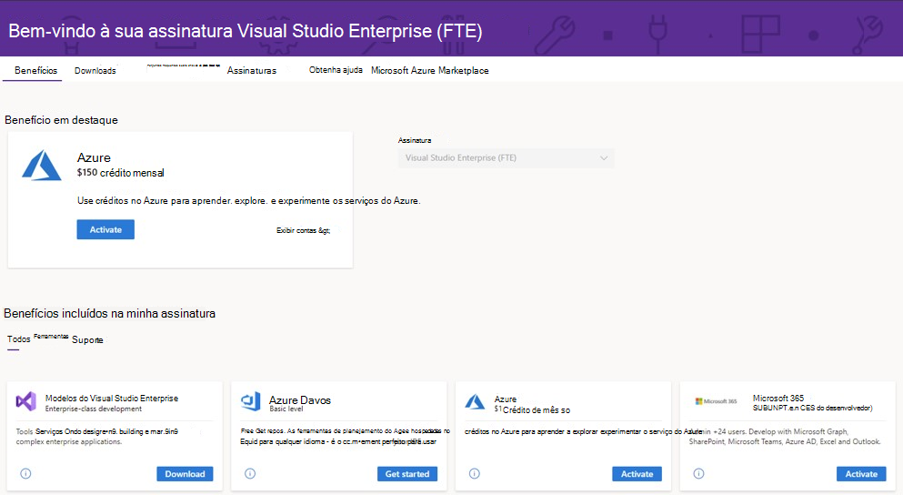

# Participe do Programa Para Desenvolvedores do Microsoft 365 com uma assinatura do Visual Studio Professional ou Enterprise

A partir desta semana, todos os novos membros do Programa Para Desenvolvedores do Microsoft 365 (incluindo os membros do Visual Studio Professional e Enterprise) podem se inscrever para obter uma assinatura de desenvolvedor do Microsoft 365 E5 (Windows não incluso). 

Assinaturas selecionadas padrão do Visual Studio Professional ou Enterprise incluem acesso ao benefício de assinatura do desenvolvedor do Microsoft 365 enquanto as assinaturas estão ativas. Sua assinatura paga do Visual Studio Professional ou Enterprise concede a você uma assinatura gratuita de desenvolvedor do Microsoft 365 com até 25 usuários. Isso pode ser útil quando você quiser criar sua própria área externa ao seu domínio corporativo para fins de desenvolvimento e teste.

Isso também concede a você status especial no Programa Para Desenvolvedores do Microsoft 365. Sua assinatura será renovada automaticamente, desde que você tenha uma assinatura válida do Visual Studio Professional ou do Enterprise.

## Como obter uma assinatura renovável de desenvolvedor do Microsoft 365?

Se você não tiver uma assinatura do Visual Studio Professional ou Enterprise e quiser uma, confira a página[Assinatura do Visual Studio](https://visualstudio.microsoft.com/vs/pricing/).

Se já tiver uma assinatura do Visual Studio Professional ou Enterprise, você pode obter uma assinatura de desenvolvedor do Microsoft 365 pelo seu portal de assinantes do Visual Studio. Vá até [https://my.visualstudio.com](https://my.visualstudio.com) e clique no bloco **Assinatura do Programa Para Desenvolvedores do Microsoft 365 (E5)** e você ingressará automaticamente no programa de desenvolvedor do Microsoft 365 com sua ID do Visual Studio.

## Qual é a diferença entre ingressar diretamente no programa e ingressar com minha assinatura do Visual Studio?

Ao ingressar no Programa Para Desenvolvedores do Microsoft 365 com sua assinatura do Visual Studio, sua assinatura de desenvolvedor da área restrita do Microsoft 365 E5 será renovada automaticamente durante a vida da sua assinatura do Visual Studio. 

Se você ingressar diretamente no programa de desenvolvedores, sua assinatura de desenvolvedor da área restrita do Microsoft 365 E5 será renovada a cada 90 dias com base em sua atividade de desenvolvimento. Para obter detalhes, consulte [Expiração e renovação da assinatura](subscription-expiration-and-renewal.md).