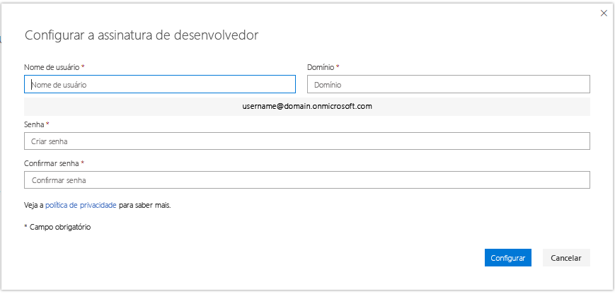

# Configurar uma assinatura de área restrita de desenvolvedor do Microsoft 365 

Configure uma assinatura de desenvolvedor do Office 365 para criar soluções independentemente do ambiente de produção. A assinatura do Office 365 Enterprise E5 Developer vem com 25 licenças de usuário. Ela dura 90 dias e é gratuita para uso apenas com fins de desenvolvimento (soluções de codificação). 

> [!NOTE] 
> Para configurar uma assinatura, você deve primeiro [ingressar no Programa para Desenvolvedores do Microsoft 365](microsoft-365-developer-program.md) diretamente ou por meio do Visual Studio Professional ou Enterprise (se você for um assinante). Depois de ingressar, você verá a opção de configurar uma assinatura.

## Configurar sua assinatura do Microsoft 365 E5 em área privada

1. Para obter uma assinatura de desenvolvedor do Microsoft 365, em sua página de perfil, escolha **Configurar assinatura**.

2. Na caixa de diálogo **Configura sua assinatura de desenvolvedor**, crie um nome de usuário e domínio. Essa conta deve ter permissões de Administrador Global e para a assinatura. Você pode escolher qualquer nome de usuário ou nome de domínio, desde que ainda não estejam em uso. Não use espaços.

  

3. Crie e confirme uma senha.

4. Escolha **Configurar**.

5. Se você for solicitado a provar que você não é um robô, siga as instruções e, em seguida, escolha **Verificar**.

6. Depois que a assinatura for criada, o nome da assinatura e a data de vencimento aparecem em sua página de perfil.

  > [!IMPORTANT]
  > Anote o nome de usuário e a senha porque você precisará deles para acessar a sua assinatura de desenvolvedor.

## Configurar a assinatura

1. Na sua página de perfil, escolha o link **Ir para a assinatura** e entre com sua ID de usuário (por exemplo, usuario@dominio.onmicrosoft.com) e a senha que você especificou para a sua assinatura de desenvolvedor.

   > [!NOTE] 
   > Não acesse sua assinatura com o ID de conta do programa de desenvolvedor.

2. Use o inicializador de aplicativos para ir para o [Centro de administração](https://admin.microsoft.com/AdminPortal/Home#/homepage).

3. Na página inicial do Centro de administração, escolha **Ir para a configuração**. Você será direcionado para a **Página de Configuração de Desenvolvedor do Microsoft 365 E5**. 

4. **Personalize seu login e email**. Você pode conectar a sua assinatura a um domínio, ou então apenas usar o subdomínio existente que você criou. Quando estiver pronto, escolha **Avançar**.

5. **Adicione novos usuários**. Você pode adicionar usuários fictícios ou reais para ajudá-lo no desenvolvimento. Quando estiver pronto, escolha **Avançar**.
    
  > [!NOTE]
  > Depois de configurar sua assinatura, você pode instalar o pacote de dados de exemplo de Usuários. O pacote de dados de exemplo de Usuários cria 16 usuários fictícios na sua assinatura e inclui as licenças para cada usuário, e caixas de correio, nomes, metadados e fotos para cada um deles. Para detalhes, confira [Instalar pacotes de dados de exemplo](install-sample-packs.md).

6. **Atribua licenças a usuários não licenciados**. Para usuários com os quais você deseja trabalhar com a assinatura, conceda a eles uma licença. Quando estiver pronto, escolha **Avançar**.

7. **Compartilhe as credenciais de entrada**. Você precisa compartilhar as credenciais de entrada com quaisquer usuários reais que irão acessar a assinatura. Você pode escolher um método, como email, download ou imprimir. Quando estiver pronto, escolha **Avançar**.

8. **Instale os aplicativos do Office**. Você tem a opção de instalar os aplicativos do Office no seu computador. Quando estiver pronto, escolha **Avançar**.

   > [!TIP] 
   > Em visitas subsequentes ao Painel, entre com sua conta *username@domain.onmicrosoft.com*.onmicrosoft.com antes de ir para o Painel.

9. **Você chegou ao final da configuração**. Você concluiu a configuração de sua assinatura. Opcionalmente, você pode classificar a experiência. Quando estiver pronto, escolha **Ir para o Centro de administração**.
    
   > [!NOTE] 
   > No momento, o padrão da região de assinatura é a América do Norte, não importando de que país/região você seja. Você ainda pode prosseguir com a configuração e o uso de sua assinatura de desenvolvedor.

## Provisionar serviços do Microsoft 365

Levará alguns minutos para que os serviços de back-end, como o SharePoint e o Exchange, sejam fornecidos para a assinatura. Durante esta etapa, alguns dos ícones no inicializador de aplicativos e na página inicial são exibidos como **Configurando (este aplicativo está ainda estão sendo configurado)**. Isso levará não mais de uma hora.

Quando o provisionamento for concluído, você poderá usar a nova assinatura do Microsoft 365 para desenvolvimento. A assinatura expira após 90 dias. Para extendê-la, consulte [Quando minha assinatura estiver prestes a expirar, posso estendê-la?](microsoft-365-developer-program-faq.yml#renew-subscription).

Também recomendamos que você habilite as opções de versão para garantir que você acesse os recursos mais recentes do Microsoft 365 assim que possível. Para mais informações, confira [Configurar as opções de versão Padrão ou Direcionada](https://support.office.com/article/set-up-the-standard-or-targeted-release-options-in-office-365-3b3adfa4-1777-4ff0-b606-fb8732101f47).

## Configurar uma conta do Microsoft Azure

Em algumas soluções do Office, talvez seja necessário ter uma conta do Microsoft Azure para criar usando os serviços do Azure. Para configurar uma conta gratuita do Azure, confira [Crie hoje mesmo sua conta gratuita do Azure](https://azure.microsoft.com/free/).

## Instalar pacotes de dados de exemplo

Você pode instalar pacotes de dados de exemplo na sua assinatura do Programa para Desenvolvedores do Microsoft 365. Os pacotes de dados de exemplo poupam seu tempo, instalando automaticamente dados e conteúdos necessários para criar e testar suas soluções. Inclui os usuários, os metadados e as fotos fictícias para simular um ambiente corporativo pequeno. Para obter detalhes sobre os pacotes de dados de exemplo que estão disponíveis e como instalá-los, confira [Instalar pacotes de dados de exemplo](install-sample-packs.md).

## Confira também

- [Participe do Programa para Desenvolvedores do Microsoft 365](microsoft-365-developer-program.md)
- [Usar sua assinatura para criar soluções do Microsoft 365](build-microsoft-365-solutions.md)
- [Renovar uma assinatura expirada](subscription-expiration-and-renewal.md)
- [Perguntas Frequentes sobre o Programa para Desenvolvedores do Microsoft 365](microsoft-365-developer-program-faq.yml)
