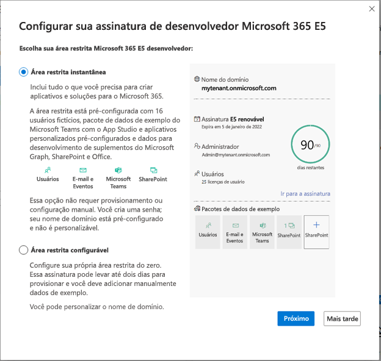

# Configurar uma assinatura de área restrita de desenvolvedor do Microsoft 365 

Configure uma área restrita de desenvolvedor do Microsoft 365 para criar soluções independentemente do ambiente de produção. Sua associação ao programa para desenvolvedores, do qual você se associou como membro regular ou por meio do Visual Studio Enterprise, inclui uma assinatura de área restrita do desenvolvedor do Microsoft 365 E5 com 25 licenças de usuário. Ela dura 90 dias e é gratuita para uso apenas com fins de desenvolvimento (soluções de codificação). Não há suporte para transações comerciais, incluindo a compra de serviços pagos.

> [!NOTE] 
> Para configurar uma assinatura, você deve primeiro [ingressar no Programa para Desenvolvedores do Microsoft 365](microsoft-365-developer-program.md) diretamente ou por meio do Visual Studio Professional ou Enterprise (se você for um assinante). Depois de ingressar, você verá a opção de configurar uma assinatura.

Você pode optar por configurar uma área restrita instantânea ou uma área restrita configurável.

## Área restrita instantânea

Se você escolher uma área restrita instantânea, poderá reduzir o tempo de configuração da área restrita de dias para segundos. A área restrita instantânea do Microsoft 365 vem pré-provisionado com Microsoft Teams, Microsoft Office SharePoint Online, Outlook e Office. Ela também inclui licenças para 24 usuários de teste mais um administrador e os aplicativos mais recentes do Microsoft 365 para seu PC e Mac, incluindo Power Apps, Power BI, Enterprise Mobility + Security, Proteção Avançada Contra Ameaças do Office 365 e Azure Active Directory.

Além disso, você obtém dados de exemplo pré-instalados, incluindo o novo pacote de dados de exemplo do Teams, bem como dados de usuário, email e calendário do Microsoft Graph e dados de exemplo da Estrutura do SharePoint, que simulam um pequeno ambiente corporativo para ajudá-lo a criar soluções na plataforma Microsoft 365. Para obter detalhes, confira Dados de exemplo da área restrita do desenvolvedor.

> [!VIDEO https://www.microsoft.com/en-us/videoplayer/embed/RWOmCY]

Você não poderá personalizar seu nome de domínio se escolher essa opção.

## Área restrita configurável

Se você escolher uma área restrita configurável, poderá personalizar seu nome de domínio. Você terá uma área restrita vazia que deve ser preenchida com dados de exemplo. Essa área restrita pode levar até dois dias para provisionar. Você pode optar por instalar os pacotes de dados de exemplo que estão disponíveis um por um no painel do programa para desenvolvedores. Para obter detalhes, confira Dados de exemplo da área restrita do desenvolvedor.

## Configurar sua assinatura do Microsoft 365 E5 em área privada

Para obter uma assinatura de desenvolvedor do Microsoft 365:

1. Em sua página de perfil, escolha **Configurar assinatura do E5**.

2. Na caixa de diálogo **Configurar sua assinatura de desenvolvedor do Microsoft 365 E5**, escolha se deseja uma área restrita instantânea ou uma área restrita configurável e escolha **Avançar**.

    

Se você selecionou uma área restrita instantânea:

1.  Escolha o **País/região de seu data center** e forneça um **Nome de usuário** e uma **Senha do administrador** e, opcionalmente, uma senha alternativa para seus usuários fictícios e, em seguida, escolha **Continuar**.

    > [!IMPORTANT] 
    > Anote o nome de usuário e a senha porque você precisará deles para acessar a sua assinatura de desenvolvedor.

2.  Forneça um número de telefone celular válido e escolha **Enviar código**. Insira o código recebido e escolha **Configurar**.

    > [!NOTE] 
    > Você deve usar um número de telefone celular válido e não VoIP (Voice over IP).

3.  Depois que a assinatura for criada, o nome de domínio da assinatura e a data de validade aparecerão na página de perfil.

Se você selecionou uma área restrita configurável:

1.  Escolha seu **País/região** e forneça um nome de usuário no campo **Criar nome de usuário** e um nome de domínio no campo **Criar domínio**. Crie e confirme sua senha e escolha **Continuar**.

    > [!IMPORTANT] 
    > Anote o nome de usuário e a senha porque você precisará deles para acessar a sua assinatura de desenvolvedor.

2.  Forneça um número de telefone celular válido e escolha **Enviar código**. Insira o código recebido e escolha **Configurar**.
3.  Depois que a assinatura for criada, o nome de domínio da assinatura e a data de validade aparecerão na página de perfil.

## Configurar a assinatura

1. Na sua página de perfil, escolha o link **Ir para a assinatura** e entre com sua ID de usuário (por exemplo, usuario@dominio.onmicrosoft.com) e a senha que você especificou para a sua assinatura de desenvolvedor.

   > [!NOTE] 
   > Não acesse sua assinatura com o ID de conta do programa de desenvolvedor.

2. Use o inicializador de aplicativos para ir para o [Centro de administração](https://admin.microsoft.com/AdminPortal/Home#/homepage).

3. Na home page do Centro de administração, escolha **Ir para configuração guiada**. Você será direcionado para a **Página de Configuração de Desenvolvedor do Microsoft 365 E5**. 

4. **Instale os aplicativos do Office**. Você tem a opção de instalar os aplicativos do Office no seu computador. Quando estiver pronto, escolha **Continuar**.

5. **Personalize seu login e email**. Você pode conectar a sua assinatura a um domínio, ou então apenas usar o subdomínio existente que você criou. Quando estiver pronto, escolha **Usar este domínio** ou escolha **Fazer isso mais tarde**.

6. **Adicione novos usuários**. Você pode adicionar usuários fictícios ou reais para ajudá-lo no desenvolvimento. Quando estiver pronto, escolha **Adicionar usuários e atribuir licenças**.
    
    > [!NOTE]
    > Se você tiver uma assinatura configurável, depois de configurar sua assinatura, poderá instalar o pacote de dados de exemplo de Usuários. O pacote de dados de exemplo de Usuários cria 16 usuários fictícios na sua assinatura e inclui as licenças para cada usuário, e caixas de correio, nomes, metadados e fotos para cada um deles. Para obter detalhes, confira [Dados de exemplo da área restrita do desenvolvedor](install-sample-packs.md).

6. **Atribua licenças a usuários não licenciados**. Para usuários com os quais você deseja trabalhar com a assinatura, conceda a eles uma licença. Quando estiver pronto, escolha **Adicionar usuários e atribuir licenças** ou **Fazer isso mais tarde**.

7. **Compartilhe as credenciais de entrada**. Você precisa compartilhar as credenciais de entrada com quaisquer usuários reais que irão acessar a assinatura. Você pode escolher um método, como email, download ou imprimir. Quando estiver pronto, escolha **Continuar**.

   > [!TIP] 
   > Em visitas subsequentes ao seu painel, entre com sua conta *username@domain*.onmicrosoft.com antes de ir para o Painel.

8. Escolha se deseja enviar um email aos usuários sobre o Microsoft Teams e escolha **Continuar**.

9. **Você chegou ao final da configuração**. Você concluiu a configuração de sua assinatura. Opcionalmente, você pode classificar a experiência. Quando estiver pronto, escolha **Ir para o Centro de administração**.
    
   > [!NOTE] 
   > No momento, o padrão da região de assinatura é a América do Norte, não importando de que país/região você seja. Você ainda pode prosseguir com a configuração e o uso de sua assinatura de desenvolvedor.

## Provisione serviços do Microsoft 365 em sua área restrita configurável

Se você tiver uma área restrita configurável, levará algum tempo para que os serviços de back-end, como o SharePoint e o Exchange, sejam provisionados para a assinatura. Durante esta etapa, alguns dos ícones no inicializador de aplicativos e na página inicial são exibidos como **Configurando (este aplicativo está ainda estão sendo configurado)**. Isso levará não mais de uma hora.

Quando o provisionamento for concluído, você poderá usar a nova assinatura do Microsoft 365 para desenvolvimento. A assinatura expira após 90 dias. Para extendê-la, consulte [Quando minha assinatura estiver prestes a expirar, posso estendê-la?](microsoft-365-developer-program-faq.yml#renew-subscription).

Também recomendamos que você habilite as opções de versão para garantir que você acesse os recursos mais recentes do Microsoft 365 assim que possível. Para mais informações, confira [Configurar as opções de versão Padrão ou Direcionada](https://support.office.com/article/set-up-the-standard-or-targeted-release-options-in-office-365-3b3adfa4-1777-4ff0-b606-fb8732101f47).

## Configurar uma conta do Microsoft Azure

Em algumas soluções do Office, talvez seja necessário ter uma conta do Microsoft Azure para criar usando os serviços do Azure. Isso não está incluído na assinatura de Desenvolvedores do Microsoft 365. Para configurar uma conta gratuita do Azure, confira [Crie hoje mesmo sua conta gratuita do Azure](https://azure.microsoft.com/free/).

## Instalar pacotes de dados de exemplo

Você pode instalar pacotes de dados de exemplo em sua área restrita configurável. Se você escolher a área restrita instantânea, os pacotes de data de exemplo virão pré-instalados.

Os pacotes de dados de exemplo poupam seu tempo, instalando automaticamente dados e conteúdos necessários para criar e testar suas soluções. Inclui os usuários, os metadados e as fotos fictícias para simular um ambiente corporativo pequeno. Para obter detalhes sobre os pacotes de dados de exemplo disponíveis e como instalá-los, confira [Dados de exemplo da área restrita do desenvolvedor](install-sample-packs.md).

## Confira também

- [Usar sua assinatura para criar soluções do Microsoft 365](build-microsoft-365-solutions.md)
- [Renovar uma assinatura expirada](subscription-expiration-and-renewal.md)
- [Perguntas Frequentes sobre o Programa para Desenvolvedores do Microsoft 365](microsoft-365-developer-program-faq.yml)
