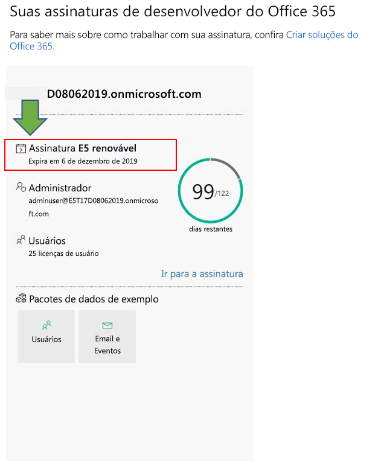
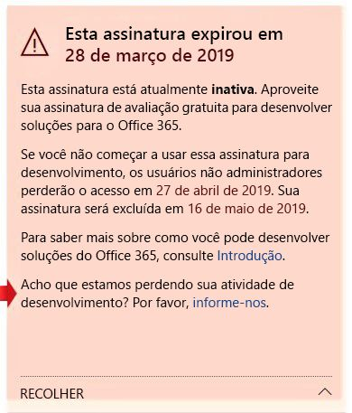

# Perguntas frequentes sobre o Programa para Desenvolvedores do Office 365

Veja a seguir as perguntas frequentes sobre o Programa de Desenvolvedores do Office 365.

## O que é o Programa de Desenvolvedor do Office 365 e quem deve participar?

O Programa para Desenvolvedores do Office 365 foi projetado para ajudar você a criar experiências de produtividade entre plataformas e voltadas para as pessoas que enriquecem o Office 365. Ingresse em nosso programa para obter acesso a ferramentas, documentação, treinamento, especialistas e eventos de comunidade que você precisa para criar soluções excelentes para produtos do Office 365 e tecnologias, como:

- Suplementos da web para [Excel](https://developer.microsoft.com/excel), [Outlook](https://developer.microsoft.com/outlook), [Word](https://developer.microsoft.com/word) e [PowerPoint](https://developer.microsoft.com/powerpoint)
- [SharePoint](https://developer.microsoft.com/sharepoint)
- [Microsoft Teams](https://developer.microsoft.com/microsoft-teams)
- [Microsoft Graph](https://developer.microsoft.com/graph)

Como participante do programa, você pode obter uma assinatura de desenvolvedor do Office 365 gratuitamente com 25 licenças de usuário para usar para criar suas soluções. A assinatura permanecerá ativa enquanto você estiver desenvolvendo e implantando soluções ativamente.

Para saber mais, confira [Ingresse no Programa de Desenvolvedores do Office 365](office-365-developer-program.md) e [Crie Soluções do Office 365](build-office-365-solutions.md).

## Qual conta posso usar para me inscrever no Programa para Desenvolvedores do Office 365?

Você pode se inscrever no programa de desenvolvedores usando um dos seguintes tipos de conta:

- **Conta da Microsoft** (criada por você para uso pessoal) - Fornece acesso a todos os produtos da Microsoft direcionados ao consumidor e serviços de nuvem, como o Outlook (Hotmail), Messenger, OneDrive, MSN, Xbox Live ou Office 365. Sua inscrição para uma caixa de correio do Outlook.com cria automaticamente um conta da Microsoft. Depois da criação de uma conta da Microsoft, ela pode ser usada para acessar serviços em nuvem direcionados ao consumidor, ou o Azure. 
- **Conta corporativa** (emitida por um administrador para uso comercial) - Fornece acesso, a todas as pequenas, médias e grandes empresas, a todos os serviços em nuvem da Microsoft, incluindo Azure, Microsoft Intune ou Office 365. Quando você acessa um desses serviços como uma organização, um diretório de nuvem é provisionado automaticamente no Azure Active Directory para representar a sua organização. Para saber mais, confira [Gerenciar seu diretório do Azure AD](https://docs.microsoft.com/azure/active-directory/active-directory-administer).
- **ID do Visual Studio** (criado para suas assinaturas do Visual Studio Professional ou Enterprise) - Recomendamos que você use esta opção para ingressar no programa de desenvolvedores a partir de dentro da Galeria do Visual Studio, para obter todos os benefícios como assinante do Visual Studio. 

## Como posso obter uma assinatura do desenvolvedor do Office 365 por meio do programa de desenvolvedores?  

Quando ingressar no Programa para Desenvolvedores do Office 365, você estará qualificado a obter uma assinatura gratuita de desenvolvedor do Office 365. Esta é uma assinatura especial, projetada para ser usada somente para desenvolvimento de aplicativos. Para saber mais, consulte [Configurar uma assinatura de desenvolvedor do Office 365](office-365-developer-program-get-started.md).

## Qual ID usar para entrar no painel do programa desenvolvedor?

Use a ID de membro para entrar no painel do programa desenvolvedor para acessar as informações sobre a assinatura. Esta é a conta da Microsoft ou o email habilitado para o Azure Active Directory que você usou para entrar no programa.

## Qual ID devo usar para entrar na minha assinatura do desenvolvedor?

Use o ID de administrador que você criou ao configurar sua assinatura de desenvolvedor. Você pode encontrar seu ID de administrador no bloco de assinatura no [painel do Programa Desenvolvedor](https://developer.microsoft.com/pt-BR/office/profile).

## O que está incluído na assinatura de desenvolvedor?

Se a assinatura foi criada após 25 de agosto de 2019, você tem uma assinatura de Desenvolvedor do Microsoft 365 E5 com 25 licenças de usuário. Os clientes que se cadastraram no programa antes de 25 de agosto de 2019 possuem uma assinatura de Desenvolvedor do Office 365 E3 com 25 licenças de usuário.

A assinatura de Desenvolvedor do Office 365 E3 inclui o seguinte:

- [Exchange Online (Plano 2)](https://products.office.com/exchange/compare-microsoft-exchange-online-plans)
- [Flow para Office 365](https://flow.microsoft.com/pricing/)
- [Proteção de informações para o Office 365 – Padrão](https://products.office.com/pt-BR/business/azure-information-protection-for-office-365)
- [Microsoft Forms (Plano E5)](https://support.office.com/article/Frequently-asked-questions-about-Microsoft-Forms-495c4242-6102-40a0-add8-df05ed6af61c)
- [Microsoft Planner](https://products.office.com/compare-all-microsoft-office-products?tab=2)
- [Pesquisa da Microsoft](https://products.office.com/en-us/business/intelligent-search?tab=Discovery)
- [Microsoft Stream para a SKU do Office 365 E5](https://products.office.com/business/office-365-enterprise-e5-business-software)
- [Microsoft Teams](https://products.office.com/business/office-365-enterprise-e5-business-software)
- [Gerenciamento de Dispositivos Móveis para o Office 365](https://support.office.com/article/Set-up-Mobile-Device-Management-MDM-in-Office-365-dd892318-bc44-4eb1-af00-9db5430be3cd)
- [Office 365 ProPlus](https://products.office.com/business/office-365-proplus-business-software)
- [Office para a Web](https://docs.microsoft.com/pt-BR/office365/servicedescriptions/office-online-service-description/office-online-service-description)
- [PowerApps para o Office 365](https://powerapps.microsoft.com/pricing/)
- [SharePoint Online para Desenvolvedores](https://products.office.com/SharePoint/compare-sharepoint-plans)
- [Skype for Business Online (Plano 2)](https://products.office.com/skype-for-business/online-meeting-solutions)
- [Sway](https://sway.com/)
- [To-Do (Plano 3)](https://todo.microsoft.com)
- [Quadro de Comunicações (Plano 2)](https://products.office.com/pt-BR/microsoft-whiteboard/digital-whiteboard-app)

A assinatura de Desenvolvedor do Microsoft 365 E5 inclui todos os aplicativos incluídos na assinatura de Desenvolvedor do Office 365 E3, além dos novos recursos a seguir:  

- Análise avançada com o Power BI  
- Enterprise Mobility + Security (EMS) para conformidade e proteção das informações  
- Proteção Avançada contra Ameaças do Office 365 
- Azure Active Directory para criar soluções avançadas de gerenciamento de identidades e acesso  

A assinatura de Desenvolvedor do Microsoft 365 E5 inclui o seguinte: 

- Azure Active Directory Premium P1 
- Azure Active Directory Premium P2 
-   Proteção Avançada contra Ameaças do Azure 
-   Proteção de Informações do Azure Premium P1 
-   Proteção de Informações do Azure Premium P2 
-   Sistema de Proteção de Dados do Cliente 
-   Exchange Online (Plano 2) 
-   Flow para Office 365 
-   Proteção de Informações para o Office 365 – Premium 
-   Proteção de informações para o Office 365 – Padrão 
-   Microsoft Azure Active Directory Rights 
-   Autenticação Multifator do Microsoft Azure 
-   Microsoft Cloud App Security 
-   Microsoft Forms (Plano E5) 
-   Microsoft Intune 
-   Microsoft MyAnalytics (Completo) 
-   Microsoft Planner 
-   Microsoft StaffHub 
-   Microsoft Stream para O365 E5 SKU 
-   Microsoft Teams 
-   Gerenciamento de Dispositivos Móveis para o Office 365 
-   Descoberta Eletrônica Avançada do Office 365 
-   Gerenciamento de Segurança Avançada do Office 365 
-   Proteção contra Ameaças do Office 365 Advanced (Plano 1) 
-   Proteção contra Ameaças do Office 365 Advanced (Plano 2) 
-   Privileged Access Management para Office 365 
-   Office 365 ProPlus 
-   Office Online 
-   Sistema Telefônico 
-   Power BI Pro 
-   PowerApps para Office 365 Plano 3 
-   SharePoint Online (Plano 2) 
-   Skype for Business Online (Plano 2) 
-   Sway 
-   To-Do (Plano 3) 
-   Quadro de Comunicações (Plano 3) 
-   Yammer Enterprise 

Você pode determinar se possui uma assinatura do Microsoft 365 E5 ou uma assinatura do Office 365 E3 no bloco de assinaturas do seu [painel](https://developer.microsoft.com/office/profile). O bloco exibirá E3 ou E5 abaixo do nome de domínio da assinatura.

.

## A assinatura também inclui uma assinatura do Azure?

Esta oferta não inclui uma assinatura do Azure. No entanto, para receber acesso gratuito aos serviços do Azure, é possível [criar uma conta gratuita do Azure](https://azure.microsoft.com/free/). 

## Quantas licenças de usuário a assinatura do desenvolvedor do Office 365 inclui?

A assinatura do desenvolvedor do Office 365 inclui 25 licenças de usuário, incluindo o administrador, somente para fins de desenvolvimento. Usar esta assinatura para qualquer objetivo que não o de desenvolvimento de aplicativos é uma violação do contrato de licença. Para saber mais sobre restrições de licenciamento, confira os [termos de uso da assinatura de desenvolvedor do Office 365](terms-and-conditions.md).

## Quanto tempo dura minha assinatura, e quando ela expira?

Sua assinatura dura 90 dias e é renovável com base em atividades válidas de desenvolvedor. Se você estiver usando sua assinatura para desenvolvimento, ela será renovada a cada três meses e durará indefinidamente. Você pode encontrar a data de vencimento, juntamente com o nome da sua assinatura, no seu [painel do Programa para Desenvolvedores do Office 365](https://developer.microsoft.com/pt-BR/office/profile). Para saber mais, consulte [Vencimento e renovação da assinatura](subscription-expiration-and-renewal.md).

Se você está ingressando no programa por meio do Visual Studio Enterprise ou Visual Studio Professional, a sua assinatura é renovada automaticamente até o término da assinatura do Visual Studio. 

## Por que não oferecem uma assinatura de um ano?

Em Abril de 2019, mudamos para um novo modelo, em que sua assinatura pode ser renovada perpetuamente a cada 90 dias se você o estiver usando ativamente para desenvolvimento. Acreditamos que esse modelo garante que os desenvolvedores que estão desenvolvendo soluções ativamente tenham uma assinatura sempre que precisarem. Se você estiver desenvolvendo com frequência, sua assinatura não expira nunca; ela é estendida automaticamente. Se você estiver desenvolvendo por um breve período e sua assinatura expirar e for excluída, você pode solicitar uma nova assinatura. 

Se quiser ter uma assinatura disponível por um período mais longo, recomendamos que você obtenha a assinatura do Visual Studio Professional ou Visual Studio Enterprise. Esses programas incluem uma assinatura de desenvolvedor gratuita do Office 365 com duração igual à da sua assinatura do Visual Studio. Para acessar, vá para [Visual Studio | Meu Benefícios](https://my.visualstudio.com/benefits). Para saber mais, contate o [Atendimento ao Cliente do Visual Studio](https://www.visualstudio.com/subscriptions/support/). 

## Como determinar se uma assinatura pode ser renovada?

Usamos um conjunto de algoritmos e telemetria que recebemos de suas atividades no Programa para Desenvolvedores do Office 365 e em sua assinatura de desenvolvedor do Office 365 para determinar se você está desenvolvendo ativamente. Podemos verificá-los regularmente para atualizar o seu status e determinar se a sua assinatura deve ser estendida. 

Se você acha que, de alguma forma, não rastreamos sua atividade de desenvolvimento com precisão, informe-nos pelo seu painel. Para enviar um formulário que nos informa como você está usando sua assinatura para desenvolvimento, no aviso do painel, escolha o link **Fale conosco**, conforme mostrado na imagem a seguir. Nós vamos revisar a sua solicitação e informá-lo se você estiver qualificado para uma extensão. 

 

## Como vocês definem atividade de desenvolvimento?

Sua atividade no Programa para Desenvolvedores do Office 365 e na sua assinatura de desenvolvedor do Office 365 determinam se você está desenvolvendo ativamente e se a assinatura deve ser estendida. 

Para mais informações sobre os tipos de atividades que monitoramos, consulte os [termos de uso da assinatura de desenvolvedor do Office 365](terms-and-conditions.md). 

## Quando minha assinatura estiver prestes a expirar, posso estendê-la?

A única maneira pela qual você pode estender sua assinatura é realizando atividades válidas de desenvolvedor. Se você estiver usando sua assinatura para desenvolver soluções personalizadas, sua assinatura expirará e acabará sendo excluída eventualmente. 

Para saber mais, consulte [Vencimento e renovação da assinatura](subscription-expiration-and-renewal.md).

## Se minha assinatura está prestes a expirar, quanto tempo tenho antes que ela seja excluída?

Após sua assinatura expirar, você terá 30 dias para migrar quaisquer dados. Pelos próximos 30 dias, somente o administrador terá acesso à assinatura e, no 60º dia, a assinatura e todos os dados serão excluídos.

## Como migrar de uma assinatura do Office 365 E3 para uma assinatura do Microsoft 365 e5?

Atualmente, somente os novos membros do Programa para Desenvolvedores do Office 365 receberão automaticamente uma assinatura de Desenvolvedor do Microsoft 365 E5. Os usuários existentes poderão migrar para uma assinatura do Microsoft 365 E5 no futuro. Fique tranquilo, estamos trabalhando para permitir que todos os membros do Programa para Desenvolvedores do Office 365 migrem para o Microsoft 365 E5. 

## Posso escolher entre ter uma assinatura do Office 365 E3 ou do Microsoft 365 E5?

Atualmente, apenas novos membros do Programa para Desenvolvedores recebem uma assinatura do Microsoft 365 E5. Os membros existentes que possuem uma assinatura do Office 365 E3 terão a opção de manter a assinatura atual e continuar renovando-a, caso não precisem dos novos recursos oferecidos no Microsoft 365 E5. Os membros do programa para desenvolvedores só podem ter uma assinatura.  

Quando tivermos uma opção de migração para membros existentes do Programa para Desenvolvedores, forneceremos mais informações sobre como migrar. 

## Como um Microsoft Partner, posso receber uma assinatura? 

Sim, você pode seguir [estas instruções](office-365-developer-program.md) para ingressar no Programa para Desenvolvedores do Office 365 e configurar uma assinatura de desenvolvedor do Office 365. No entanto, se você já tiver uma assinatura do Visual Studio Enterprise ou Visual Studio Professional (MSDN), você pode obter uma assinatura de desenvolvedor do Office 365 como benefício. Para acessar, vá para [Visual Studio | Meu Benefícios](https://my.visualstudio.com/benefits). Para saber mais, contate o [Atendimento ao Cliente do Visual Studio](https://www.visualstudio.com/subscriptions/support/). 

## Como funcionário da Microsoft em tempo integral, posso receber uma assinatura?

Funcionários da Microsoft não podem se inscrever para essa oferta. Todos os funcionários de tempo integral Microsoft têm acesso a uma assinatura gratuita do Visual Studio (MSDN), que inclui acesso a assinatura de desenvolvedor do Microsoft 365 E5. Você pode acessar esse benefício em [Visual Studio | Meu benefícios](https://my.visualstudio.com/benefits).

## Como fornecedor da Microsoft, sou elegível para uma assinatura?

Sim, você pode seguir [estas instruções](office-365-developer-program.md) para ingressar no Programa de Desenvolvedores do Office 365 e configurar uma assinatura de desenvolvedor do Office 365. Mesmo para fornecedores, a assinatura foi projetada para ser usada _apenas para o desenvolvimento de aplicativos_. Se você não estiver realizando atividades válidas de desenvolvimento, sua assinatura não será renovada.

## O Programa para Desenvolvedores do Office 365 está disponível em meu idioma?

Além de em inglês, o Programa para Desenvolvedores do Office 365 está disponível nos seguintes idiomas: chinês (simplificado), francês, alemão, japonês, português (Brasil), russo e espanhol.

## A assinatura de desenvolvedor do Office 365 está disponível em meu idioma?

A assinatura de desenvolvedor do Office 365 é oferecida somente em inglês.

## Suporte

Se você tiver problemas ao configurar sua assinatura, confira os seguintes recursos de suporte:

- [Stack Overflow](https://stackoverflow.com/questions)   
- [Atendimento ao Cliente do Visual Studio](https://www.visualstudio.com/subscriptions/support/)

## Confira também

- [Ingressar no Programa para Desenvolvedores do Office 365](office-365-developer-program.md)
- [Configurar uma assinatura de desenvolvedor do Office 365](office-365-developer-program-get-started.md)
- [Usar sua assinatura para criar soluções do Office 365](build-office-365-solutions.md)
- [Renovar uma assinatura expirada](subscription-expiration-and-renewal.md)

 

 

 

 

 

 
