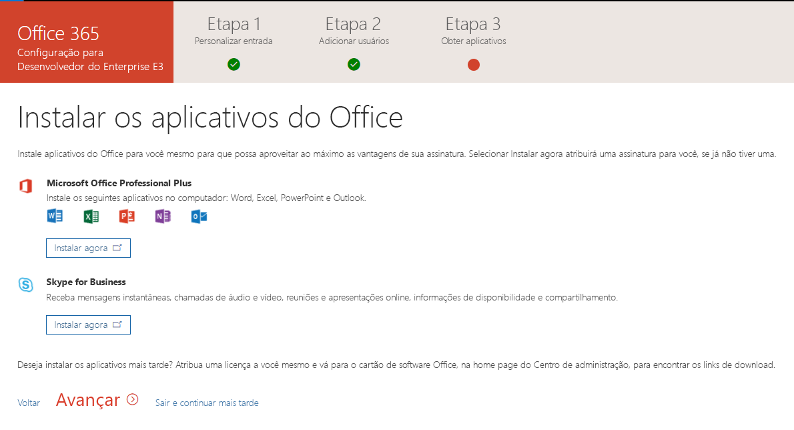

# Configurar uma assinatura de desenvolvedor do Office 365 

Configure uma assinatura de desenvolvedor do Office 365 para criar suas soluções independentemente de seu ambiente de produção. A assinatura é uma assinatura do Office 365 Enterprise E3 Developer com 25 licenças de usuário. Ela dura 90 dias e é gratuita para uso para fins de desenvolvimento (soluções de codificação).

> [!NOTE] 
> Para configurar uma assinatura, primeiro é necessário [entrar no Programa de Desenvolvedores do Office 365](office-365-developer-program.md). Depois de ingressar, você verá a opção de configurar uma assinatura.

## Configurar a assinatura

1. Para obter uma assinatura de desenvolvedor do Office 365, em sua página de perfil, em **Precisa de uma assinatura do Office 365 para desenvolvimento?**, escolha **Configurar uma assinatura**.

  

2. Na caixa de diálogo**Configura sua assinatura de desenvolvedor**, crie um nome de usuário e domínio. Essa conta deve ter permissões de Administrador Global e para a assinatura. Você pode escolher qualquer nome de usuário ou nome de domínio, desde que ainda não estejam em uso. Não use espaços.

  

3. Crie e confirme uma senha.

4. Escolha **Configurar**.

5. Se você for solicitado a provar que você não é um robô, siga as instruções e, em seguida, escolha **Verificar**.

6. Depois que a assinatura for criada, o nome da assinatura e a data de vencimento aparecem em sua página de perfil.

  > [!IMPORTANT]
  > Anote o nome de usuário e a senha porque você precisará deles para acessar a sua assinatura de desenvolvedor.

## Configurar a assinatura

1. Na página de perfil, escolha o link [office.com](https://www.office.com/) e entre com sua ID de usuário (por exemplo, username@domain.onmicrosoft.com) e a senha que você especificou para sua assinatura de desenvolvedor.

   > [!NOTE] 
   > Não acesse sua assinatura com as credenciais do programa de desenvolvedor.

2. Use o inicializador de aplicativos para ir para o [Centro de administração](https://portal.office.com/adminportal/home#/homepage).

3. Na página inicial do Centro de administração, escolha **Ir para a configuração**. Isso levará você à página **Configuração do Office 365 Enterprise E3 Developer**.

4. **Personalize seu login e email**. Você pode conectar a sua assinatura a um domínio, ou então apenas usar o subdomínio existente que você criou. Quando estiver pronto, escolha **Avançar**.

  

5. **Adicione novos usuários**. Você pode adicionar novos usuários. Estes podem ser usuários fictícios, ou usuários reais para ajudar no seu desenvolvimento. Quando estiver pronto, escolha **Avançar**.
    
  > [!NOTE]
  > Se você precisar adicionar usuários em massa, você pode fazer isso mais tarde. Para saber mais, confira [Adicionar usuários individualmente ou em massa no Office 365 – Ajuda para Administradores](https://support.office.com/article/add-users-individually-or-in-bulk-to-office-365-admin-help-1970f7d6-03b5-442f-b385-5880b9c256ec).

6. **Atribua licenças a usuários não licenciados**. Para usuários com os quais você deseja trabalhar com a assinatura, conceda a eles uma licença. Quando estiver pronto, escolha **Avançar**.

7. **Compartilhe as credenciais de entrada**. Você precisa compartilhar as credenciais de entrada com quaisquer usuários reais que irão acessar a assinatura. Você pode escolher um método, como email, download ou imprimir. Quando estiver pronto, escolha **Avançar**.

8. **Instale os aplicativos do Office**. Você tem a opção de instalar os aplicativos do Office no seu computador. Quando estiver pronto, escolha **Avançar**.

  

   > [!TIP] 
   > Em visitas subsequentes ao Painel, entre com sua conta *username@domain*onmicrosoft.com antes de ir para o Painel.

9. **Você chegou ao final da configuração**. Você concluiu a configuração de sua assinatura. Opcionalmente, você pode classificar a experiência. Quando estiver pronto, escolha **Ir para o Centro de administração**.
    
   > [!NOTE] 
   > No momento, o padrão da região de assinatura é a América do Norte, não importando de que país/região você seja. Você ainda pode prosseguir com a configuração e o uso de sua assinatura de desenvolvedor.

## Fornecer serviços do Office 365

Levará alguns minutos para que os serviços de back-end, como o SharePoint e o Exchange, sejam fornecidos para a assinatura. Durante esta etapa, alguns dos ícones no inicializador de aplicativos e na página inicial são exibidos como **Configurando (este aplicativo está ainda estão sendo configurado)**. Isso levará não mais de uma hora.

Quando o provisionamento for concluído, você poderá usar a nova assinatura do Office 365 para desenvolvimento. A assinatura expira após 90 dias. Para extendê-la, consulte [Quando minha assinatura estiver prestes a expirar, posso estendê-la?](office-365-developer-program-faq.md#renew-subscription).

Também recomendamos que você habilite opções de versão para garantir que você acesse os recursos mais recentes do Office 365 assim que possível. Para saber mais, confira [Configurar as opções de versão padrão ou direcionadas no Office 365](https://support.office.com/article/set-up-the-standard-or-targeted-release-options-in-office-365-3b3adfa4-1777-4ff0-b606-fb8732101f47).

## Configurar uma conta do Microsoft Azure

Em algumas soluções do Office, talvez seja necessário ter uma conta do Microsoft Azure para criar usando os serviços do Azure. Para configurar uma conta gratuita do Azure, confira [Crie hoje mesmo sua conta gratuita do Azure](https://azure.microsoft.com/free/).

## Deixar o Programa para Desenvolvedores do Office 365

Se você decidir que não deseja mais participar do Programa de Desenvolvedor do Office 365, você pode encerrar a assinatura e deixar o programa.

  > [!WARNING]
  > As etapas a seguir apagarão todas as suas informações de perfil. Você perderá os dados armazenados em sua assinatura de desenvolvedor, que não tem backup em outro lugar.

1. Entre no Programa para Desenvolvedores do Office 365.

2. Escolha **Excluir perfil**.

3. Na caixa de confirmação **Excluir perfil**, escolha **Excluir**.

## Confira também

- [Ingresse no Programa para Desenvolvedores do Office 365](office-365-developer-program.md)
- [Use sua assinatura para criar soluções do Office 365](build-office-365-solutions.md)
- [Renovar uma assinatura prestes a expirar](subscription-expiration-and-renewal.md)
- [Perguntas frequentes sobre o Programa para Desenvolvedores do Office 365](office-365-developer-program-faq.md)
