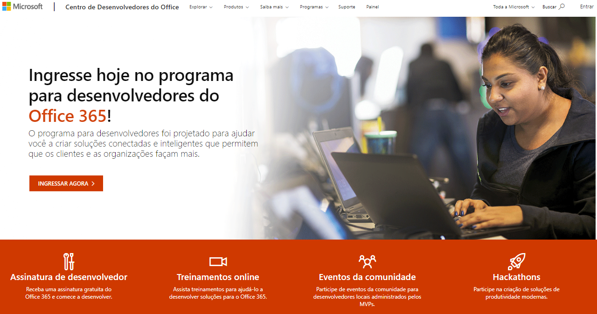
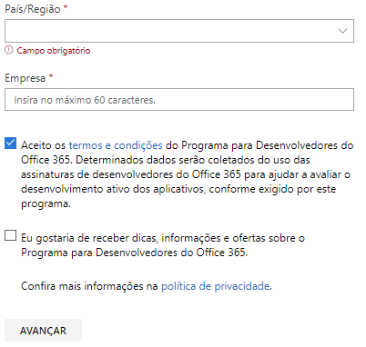
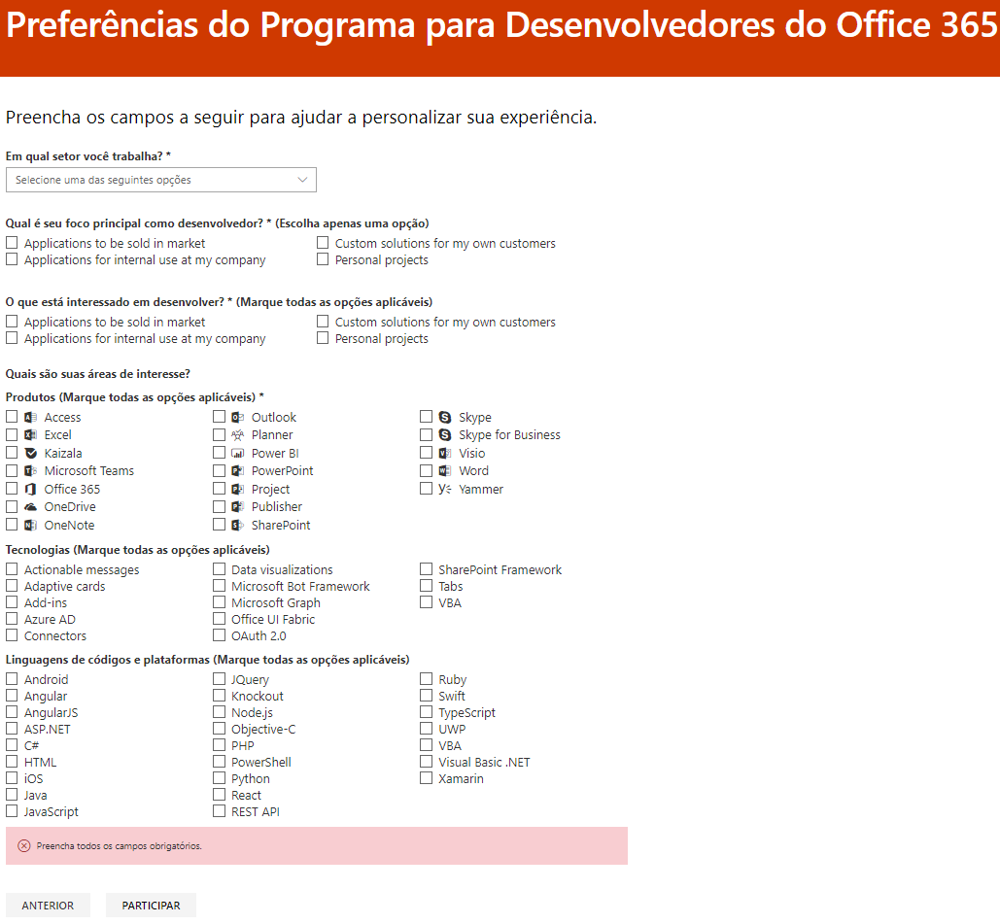
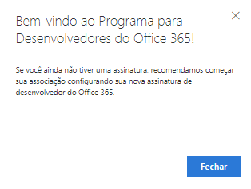

# Bem-vindo ao Programa para Desenvolvedores do Office 365

Junte-se a seus amigos e colegas no Programa para Desenvolvedores do Office 365. Use a assinatura de desenvolvedor do Office 365 para desenvolver e testar suas soluções independentemente de seu ambiente de produção. Você pode criar soluções para Microsoft Teams, suplementos do Office, Microsoft Graph, SharePoint Framework, suplementos do SharePoint e muito mais.

## Entre no Programa para Desenvolvedores do Office 365

1. Vá para a página [Entrar no Programa de Desenvolvedores do Office 365](https://developer.microsoft.com/pt-BR/office/dev-program). 

2. No canto superior direito, escolha **Entrar** para entrar com sua conta da Microsoft ou email habilitado para o Azure Active Directory. 

  

3. Depois de entrar, escolha **Participar já**.

4. Na página **Inscrição no Programa de Desenvolvedores do Office 365**, preencha os seguintes campos no formulário online:

  - **Email de contato**
  - **País/região**
  - **Empresa**

  

5. Analise os **termos e condições**. Você precisará marcar a caixa de seleção antes de poder participar.

6. Opcionalmente, selecione a caixa de seleção **Eu gostaria de saber mais sobre o Programa de Desenvolvedores do Office 365** se quiser que a Microsoft o informe sobre novas capacidades e outras atualizações. 

7. Escolha **Avançar**.

8. Na página **Preferências do Programa de Desenvolvedores do Office 365**, conte-nos suas preferências para que possamos personalizar sua experiência, incluindo:

  - O setor em que você trabalha.
  - O tipo de aplicativos ou soluções que você tem interesse em desenvolver.
  - Produtos, tecnologias e linguagens de programação em que você tem interesse.

  

9. Ao finalizar, clique em **Participar**. Suas preferências aparecem na página seguinte, no canto superior direito, e você recebe uma mensagem de boas-vindas.

  

## Próximas etapas

- [Configurar uma assinatura de desenvolvedor do Office 365](office-365-developer-program-get-started.md). 

- Depois de concluir sua assinatura de desenvolvedor, [use sua assinatura](build-office-365-solutions.md) para criar os tipos de solução que você deseja.

- Para perguntas frequentes sobre o Programa de Desenvolvedores do Office 365, confira [Perguntas Frequentes](office-365-developer-program-faq.md). 
