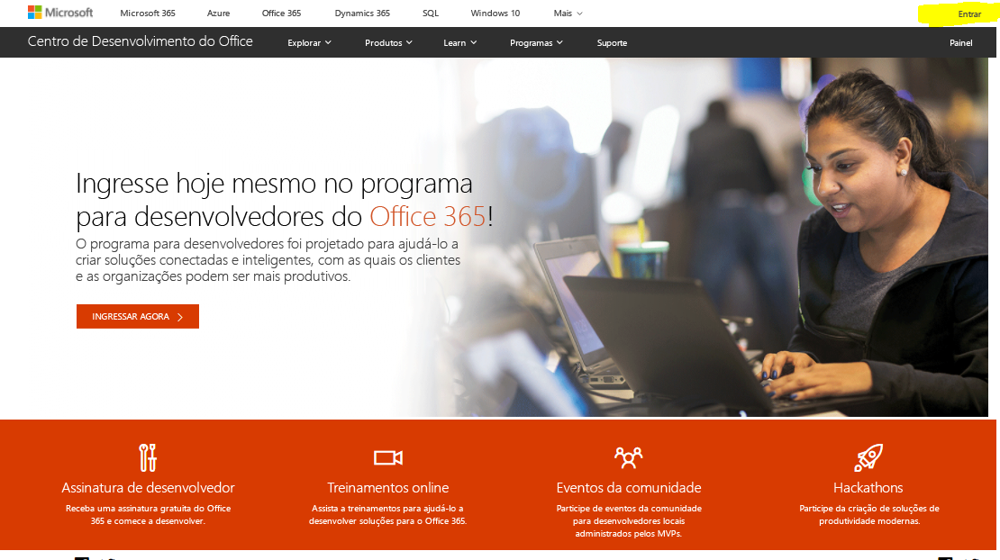
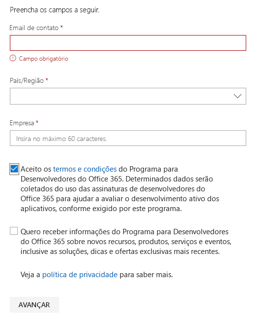
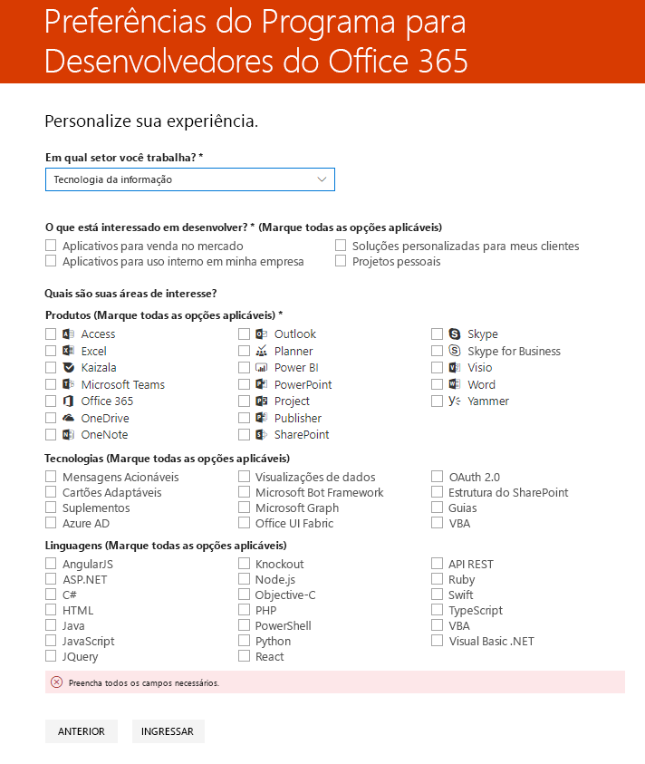
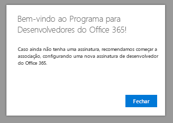

# Bem-vindo ao Programa para Desenvolvedores do Office 365Welcome to the Office 365 Developer Program

Junte-se a seus amigos e colegas no Programa para Desenvolvedores do Office 365.Join your friends and colleagues in the Office 365 Developer Program. Use a assinatura de desenvolvedor do Office 365 para desenvolver suas soluções independentemente de seu ambiente de produção.Use the Office 365 developer subscription to develop your solutions independent of your production environment. Você pode criar soluções para Microsoft Teams, suplementos do Office, Microsoft Graph, SharePoint Framework, suplementos do SharePoint e muito mais.You can build solutions for Microsoft Teams, Office Add-ins, Microsoft Graph, SharePoint Framework, SharePoint Add-ins, and more.

## Entre no Programa para Desenvolvedores do Office 365Join the Office 365 Developer Program

1. Vá para a página [Entrar no Programa de Desenvolvedores do Office 365](https://developer.microsoft.com/office/dev-program).Go to the [Join the Office 365 Developer Program](https://developer.microsoft.com/office/dev-program) page. 

2. No canto superior direito, escolha **Entrar** para entrar com sua conta da Microsoft ou email habilitado para o Azure Active Directory.In the upper-right corner, choose **Sign in** to sign in with your Microsoft account or Azure Active Directory-enabled email. 

  

3. Depois de entrar, escolha **Participar já**.After signing in, choose **Join now**.

4. Na página **Inscrição no Programa de Desenvolvedores do Office 365**, preencha os seguintes campos no formulário online:On the **Office 365 Developer Program Signup** page, complete the following fields in the online form:

  - **Email de contato****Contact Email**
  - **País/região****Country/Region**
  - **Empresa****Company**

  

5. Analise os **termos e condições**.Review the **terms and conditions**. Você precisará marcar a caixa de seleção antes de poder participar.You'll need to select the check box before you can join.

6. Opcionalmente, selecione a caixa de seleção **Eu gostaria de saber mais sobre o Programa de Desenvolvedores do Office 365** se quiser que a Microsoft o informe sobre novas capacidades e outras atualizações.Optionally, select the **I would like to hear from the Office 365 Developer Program** check box if you want to hear from Microsoft about new capabilities and other updates. 

7. Escolha **Avançar**.Choose **Next**.

8. Na página **Preferências do Programa de Desenvolvedores do Office 365**, conte-nos suas preferências para que possamos personalizar sua experiência, incluindo:On the **Office 365 Developer Program Preferences** page, tell us your preferences so we can personalize your experience, including:

  - O setor em que você trabalha.The industry that you work in.
  - O tipo de aplicativos ou soluções que você tem interesse em desenvolver.The type of applications or solutions that you're interested in developing.
  - Produtos, tecnologias e linguagens de programação em que você tem interesse.Products, technologies, and programming languages that you're interested in.

  

9. Ao finalizar, clique em **Participar**.When you're finished, choose **Join**. Suas preferências aparecem na página seguinte, no canto superior direito, e você recebe uma mensagem de boas-vindas.Your preferences appear on the next page in the top right, and you receive a Welcome message.

  

## Próximas etapasNext steps

- [Configurar uma assinatura de desenvolvedor do Office 365](office-365-developer-program-get-started.md).[Set up an Office 365 developer subscription](office-365-developer-program-get-started.md). 

- Depois de concluir sua assinatura de desenvolvedor, [use sua assinatura](build-office-365-solutions.md) para criar os tipos de solução que você deseja.After you have your developer subscription, [use your subscription](build-office-365-solutions.md) to build the types of solutions that you want.

- Para obter informações sobre assinaturas prestes a expirar, consulte [Vencimento e renovação da assinatura](subscription-expiration-and-renewal.md).For information about expiring subscriptions, see [Subscription expiration and renewal](subscription-expiration-and-renewal.md).

- Para perguntas frequentes sobre o Programa de Desenvolvedores do Office 365, confira [Perguntas Frequentes](office-365-developer-program-faq.md).For frequently asked questions about the Office 365 Developer Program, see the [FAQ](office-365-developer-program-faq.md).

