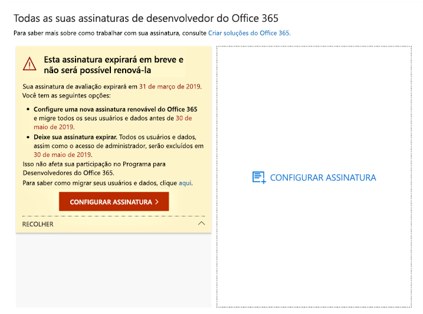
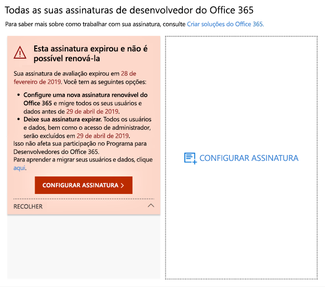
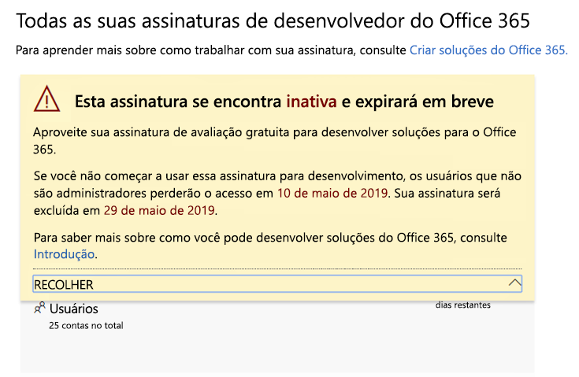
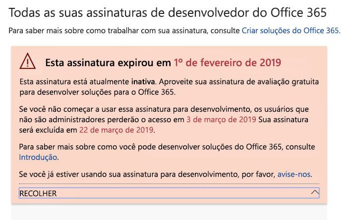
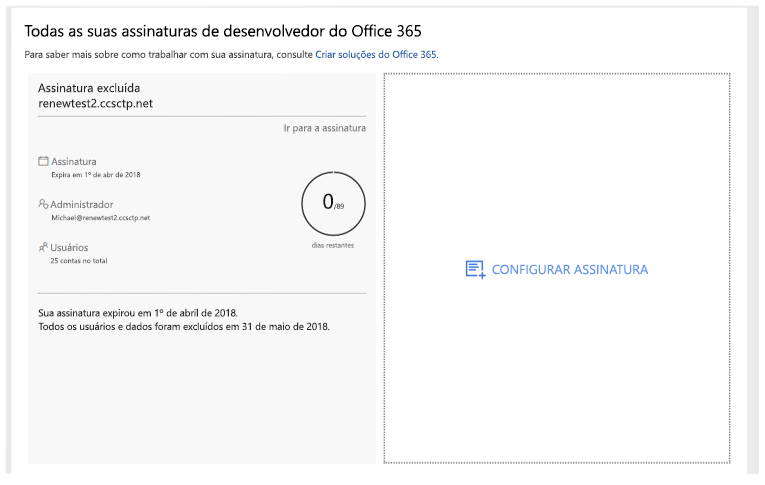

# Expiração e renovação da assinatura do Programa para Desenvolvedores do Office 365

Sua associação ao Programa para Desenvolvedores do Microsoft 365 inclui uma assinatura de desenvolvedor gratuita do Office 365 E3 ou Microsoft 365 E5. Sua assinatura do desenvolvedor é renovável com base em suas atividades de desenvolvimento; no entanto, algumas assinaturas mais antigas expiram. Este artigo descreve a diferença entre assinaturas renováveis e não renovável e como atualizar sua assinatura se ela expirar.

## Assinaturas do desenvolvedor expiráveis versus renováveis

Com o lançamento do Programa para Desenvolvedores do Microsoft 365, oferecemos assinaturas de desenvolvedor de 12 meses que expiram e não podem ser renovadas. Em agosto de 2018, começamos a fornecer assinaturas renováveis para alguns membros do programa para desenvolvedores.

A partir de abril de 2019, oferecemos assinaturas renováveis de 90 dias.

Você pode determinar se possui uma assinatura renovável ou não renovável, visualizando o [painel do Programa para Desenvolvedores do Microsoft 365](https://aka.ms/DevProgramDashboard).

## Assinaturas não renováveis

Se você optou por sua assinatura antes de agosto de 2018, sua assinatura não é renovável e você verá o seguinte aviso em seu painel. Você precisará substituir sua assinatura antes que a atual expire. O texto de aviso indica que a assinatura não pode ser renovada. Também enviaremos um e-mail para lembrá-lo de que sua assinatura está expirando.
 
 

Quando sua assinatura expirar, você verá o seguinte texto de aviso.

 

Para criar uma assinatura em substituição, escolha **Configurar Assinatura**. 

Você também precisará migrar quaisquer dados importantes que você precise salvar para sua nova assinatura. Para detalhes, confira [Como migrar meus dados?](#migrate-data) mais adiante neste tópico.

## Assinaturas renováveis

Se você optou por sua assinatura depois de agosto de 2018, é possível que você tenha uma assinatura renovável. Se sua assinatura estiver inativa, você verá o seguinte aviso no seu painel. 

 

Quando sua assinatura expirar, você verá o seguinte texto de aviso.

 

Se você for um desenvolvedor ativo, sua assinatura será renovada automaticamente por mais 90 dias a partir da data original de vencimento. 

## Por que minha assinatura atual não é renovável?

Introduzimos assinaturas renováveis em agosto de 2018. Se você optou por sua assinatura antes dessa data, ela não é renovável e você precisará configurar uma nova quando expirar.

## Como eu migro meus dados quando a minha assinatura expirar?

Para migrar seus dados da sua assinatura atual para uma nova assinatura, consulte os seguintes recursos:

- [Como migrar caixas de correio de um locatário para outro](/exchange/mailbox-migration/migrate-mailboxes-across-tenants)
- [Usar o PowerShell para executar uma migração em etapas](/office365/enterprise/powershell/use-powershell-to-perform-a-staged-migration-to-office-365)
- [Migração de uma assinatura para outra sem terceiros](https://social.technet.microsoft.com/Forums/en-US/ee507441-eb91-4b0a-ba6c-5bd9bb8c71b1/migration-from-one-o365-tenant-to-another-o365-without-third-party?forum=onlineservicesmigrationandcoexistence)

## Como eu sei se a minha assinatura foi excluída?

Quando sua assinatura for excluída, você verá uma notificação em seu painel de que a assinatura e sua ID foram excluídas, conforme mostrado na captura de tela a seguir. 

 

## Confira também

- [Participe do Programa para Desenvolvedores do Microsoft 365](microsoft-365-developer-program.md)
- [Configurar uma assinatura de desenvolvedor do Microsoft 365](microsoft-365-developer-program-get-started.md)
- [Usar sua assinatura para criar soluções do Microsoft 365](build-microsoft-365-solutions.md)
- [Perguntas Frequentes sobre o Programa para Desenvolvedores do Microsoft 365](microsoft-365-developer-program-faq.md)

